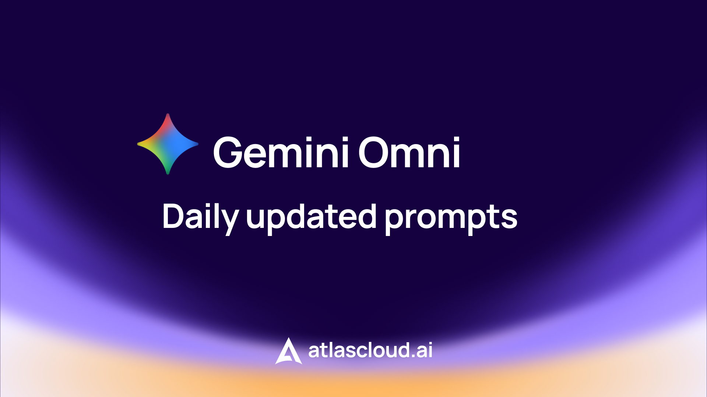

# 🎬 Awesome Gemini Omni Prompts



[](https://awesome.re)
[](https://github.com/AtlasCloudAI/Awesome-Gemini-Omni-API-Prompts/stargazers)
[](LICENSE)
[](https://github.com/AtlasCloudAI/Awesome-Gemini-Omni-API-Prompts/pulls)
[](https://github.com/AtlasCloudAI/Awesome-Gemini-Omni-API-Prompts)

Una coleccion curada de ejemplos de prompts para Gemini Omni con vista previa de video OSS integrada.

Este repositorio organiza ejemplos publicos de video de Gemini Omni. Cada entrada incluye un video de vista previa y un prompt localizado.

- **Actual:** Español (Latinoamérica)
- **Otros Idiomas:** [English](./README.md) | [简体中文](./README_zh.md) | [繁體中文](./README_zh-TW.md) | [日本語](./README_ja-JP.md) | [한국어](./README_ko-KR.md) | [ไทย](./README_th-TH.md) | [Tiếng Việt](./README_vi-VN.md) | [हिन्दी](./README_hi-IN.md) | [Español](./README_es-ES.md) | [Deutsch](./README_de-DE.md) | [Français](./README_fr-FR.md) | [Italiano](./README_it-IT.md) | [Português (Brasil)](./README_pt-BR.md) | [Português](./README_pt-PT.md) | [Türkçe](./README_tr-TR.md)

## 🤔 What is Gemini Omni?

Gemini Omni is Google's multimodal video model — text-to-video, image-to-video and reference-to-video with native, synchronized audio. On Atlas Cloud it runs as `google/gemini-omni-flash/*`. Every preview below was generated through Atlas Cloud from the listed prompt.

## 📊 Estadisticas

| Metrica | Cantidad |
| --- | ---: |
| Prompts Totales | 102 |
| Categorias | 10 |
| Videos de Vista Previa | 102 |
| Ultima Actualizacion | 10/06/2026 |

### 🧩 Supported Models

- 🎬 **Video** — Seedance 2.0 · Kling 3 · Sora 2 · Veo 3.1 · HappyHorse 1 · Grok Imagine 1.5 · Wan 2.7
- 🎨 **Image** — Nano Banana 2/Pro · GPT Image 2 · Flux 2 · Seedream 5
- 💬 **LLM** — Claude · GPT · DeepSeek · MiniMax · Kimi · GLM · Qwen
- 🔊 **Audio** — Grok TTS
- 📚 **Explore more** — [300+ models »](https://www.atlascloud.ai/models?utm_source=github&utm_campaign=awesome-gemini-omni-prompts)

## ▶ Run any prompt via Atlas Cloud

**Skill (recommended):** Install [atlas-cloud-skills](https://github.com/AtlasCloudAI/atlas-cloud-skills) in Claude Code, Codex, or Gemini CLI, then just ask it to generate any prompt from this collection.

**CLI:** Prefer the terminal? Use [atlascloud-cli](https://github.com/AtlasCloudAI/cli) to run prompts directly.

**[→ Get your free Atlas Cloud API key](https://www.atlascloud.ai/console/api-keys?utm_source=github&utm_campaign=awesome-gemini-omni-prompts)**

## 🏷️ Explorar por Categoria

- [Transform & Stylization](#category-1)
- [Action & Motion](#category-2)
- [Camera & Perspective](#category-3)
- [Text & Sequences](#category-4)
- [Multi-Input & Reference](#category-5)
- [Atlas Generado T2V](#category-6)
- [Atlas Generado I2V](#category-7)
- [Atlas Generated I2V](#category-8)
- [I2V Generado por Atlas](#category-9)
- [Atlas Generated T2V](#category-10)

## Todos los Prompts

<a id="category-1"></a>

### Transform & Stylization (10)

### No. 1: Mirror: Liquid Metal Ripple

- **Categoria:** `Transform & Stylization`
- **Fuente:** `DeepMind Official`
- **Autor:** omni_001
- **Idioma:** `es-419`
- **Video:** [Ver](https://static.atlascloud.ai/prompt/omni/001_mirror_liquid_metal.webm)

<video src="https://static.atlascloud.ai/prompt/omni/001_mirror_liquid_metal.webm" controls muted playsinline width="720"></video>

#### Descripcion

Mirror touch triggers a liquid-metal ripple effect and turns the arm into reflective mirror material.

#### Prompt

```text
When the person touches the mirror, make the mirror ripple beautifully like liquid, and the person's arm turns into reflective mirror material
```

### No. 2: Mirror: Line Art Transformation

- **Categoria:** `Transform & Stylization`
- **Fuente:** `DeepMind Official`
- **Autor:** omni_002
- **Idioma:** `es-419`
- **Video:** [Ver](https://static.atlascloud.ai/prompt/omni/002_mirror_line_art.webm)

<video src="https://static.atlascloud.ai/prompt/omni/002_mirror_line_art.webm" controls muted playsinline width="720"></video>

#### Descripcion

Mirror touch transforms the subject into a detailed monochrome line drawing.

#### Prompt

```text
When the person touches the mirror, the person transforms into a detailed monochrome line art drawing
```

### No. 3: Mirror: Puppet Transformation

- **Categoria:** `Transform & Stylization`
- **Fuente:** `DeepMind Official`
- **Autor:** omni_003
- **Idioma:** `es-419`
- **Video:** [Ver](https://static.atlascloud.ai/prompt/omni/003_mirror_puppet.webm)

<video src="https://static.atlascloud.ai/prompt/omni/003_mirror_puppet.webm" controls muted playsinline width="720"></video>

#### Descripcion

Mirror touch swaps the subject into a cute felt puppet with big googly eyes and glasses.

#### Prompt

```text
When the person touches the mirror, the person suddenly transforms into a cute felted stuffed puppet version with large googley eyes and glasses
```

### No. 4: Mirror: Holograph Transformation

- **Categoria:** `Transform & Stylization`
- **Fuente:** `DeepMind Official`
- **Autor:** omni_004
- **Idioma:** `es-419`
- **Video:** [Ver](https://static.atlascloud.ai/prompt/omni/004_mirror_holograph.webm)

<video src="https://static.atlascloud.ai/prompt/omni/004_mirror_holograph.webm" controls muted playsinline width="720"></video>

#### Descripcion

Mirror touch converts the person and room into a vintage transparent holodeck-like hologram scene.

#### Prompt

```text
When the person touches the mirror, the person instantly transform into a vintage monochrome transparent 3d line art hologram, inside of a monochrome 3d holodeck maintaining the structure and details of the room and environment
```

### No. 5: Mirror: Voxel World

- **Categoria:** `Transform & Stylization`
- **Fuente:** `DeepMind Official`
- **Autor:** omni_005
- **Idioma:** `es-419`
- **Video:** [Ver](https://static.atlascloud.ai/prompt/omni/005_mirror_voxel_world.webm)

<video src="https://static.atlascloud.ai/prompt/omni/005_mirror_voxel_world.webm" controls muted playsinline width="720"></video>

#### Descripcion

Mirror touch turns the whole room into chunky 3D voxel art.

#### Prompt

```text
When the person touches the mirror, the entire environment turns into 3d voxel art
```

### No. 6: Butterfly to Bee

- **Categoria:** `Transform & Stylization`
- **Fuente:** `DeepMind Prompt Guide`
- **Autor:** omni_015
- **Idioma:** `es-419`
- **Video:** [Ver](https://static.atlascloud.ai/prompt/omni/015_butterfly_to_bee.webm)

<video src="https://static.atlascloud.ai/prompt/omni/015_butterfly_to_bee.webm" controls muted playsinline width="720"></video>

#### Descripcion

Morph the butterfly into a bee.

#### Prompt

```text
Change the butterfly to a bee.
```

### No. 7: Bee to Fireflies

- **Categoria:** `Transform & Stylization`
- **Fuente:** `DeepMind Prompt Guide`
- **Autor:** omni_016
- **Idioma:** `es-419`
- **Video:** [Ver](https://static.atlascloud.ai/prompt/omni/016_bee_to_fireflies.webm)

<video src="https://static.atlascloud.ai/prompt/omni/016_bee_to_fireflies.webm" controls muted playsinline width="720"></video>

#### Descripcion

Morph the bee into a small swarm of fireflies.

#### Prompt

```text
Change the bee into a small swarm of fireflies.
```

### No. 8: Spaceships: White Origami

- **Categoria:** `Transform & Stylization`
- **Fuente:** `DeepMind Prompt Guide`
- **Autor:** omni_023
- **Idioma:** `es-419`
- **Video:** [Ver](https://static.atlascloud.ai/prompt/omni/023_spaceships_white_origami.webm)

<video src="https://static.atlascloud.ai/prompt/omni/023_spaceships_white_origami.webm" controls muted playsinline width="720"></video>

#### Descripcion

Transform the ships so they look like folded white origami paper.

#### Prompt

```text
Change the ships to be made from white origami paper.
```

### No. 9: Astronaut to Sea Anemone

- **Categoria:** `Transform & Stylization`
- **Fuente:** `DeepMind Prompt Guide`
- **Autor:** omni_024
- **Idioma:** `es-419`
- **Video:** [Ver](https://static.atlascloud.ai/prompt/omni/024_astronaut_sea_anemone.webm)

<video src="https://static.atlascloud.ai/prompt/omni/024_astronaut_sea_anemone.webm" controls muted playsinline width="720"></video>

#### Descripcion

Transform the astronaut into a sea anemone.

#### Prompt

```text
Change the astronaut to a sea anemone.
```

### No. 10: Small Ships to Stingrays

- **Categoria:** `Transform & Stylization`
- **Fuente:** `DeepMind Prompt Guide`
- **Autor:** omni_025
- **Idioma:** `es-419`
- **Video:** [Ver](https://static.atlascloud.ai/prompt/omni/025_small_ships_to_stingrays.webm)

<video src="https://static.atlascloud.ai/prompt/omni/025_small_ships_to_stingrays.webm" controls muted playsinline width="720"></video>

#### Descripcion

Transform the small ships into stingrays.

#### Prompt

```text
Change the small ships to stingrays.
```

<a id="category-2"></a>

### Action & Motion (6)

### No. 11: Hand Hole Super Zoom

- **Categoria:** `Action & Motion`
- **Fuente:** `DeepMind Official`
- **Autor:** omni_006
- **Idioma:** `es-419`
- **Video:** [Ver](https://static.atlascloud.ai/prompt/omni/006_handhole_super_zoom.webm)

<video src="https://static.atlascloud.ai/prompt/omni/006_handhole_super_zoom.webm" controls muted playsinline width="720"></video>

#### Descripcion

A hand-shaped hole behaves like a surreal magnifying lens that super-zooms into the ground.

#### Prompt

```text
Make it look like the weird shape of my hand hole super zooms and magnifies the ground it's looking at in sharper quality.
```

### No. 12: Animal Toy Sound Interaction

- **Categoria:** `Action & Motion`
- **Fuente:** `DeepMind Official`
- **Autor:** omni_007
- **Idioma:** `es-419`
- **Video:** [Ver](https://static.atlascloud.ai/prompt/omni/007_animal_toy_sound.webm)

<video src="https://static.atlascloud.ai/prompt/omni/007_animal_toy_sound.webm" controls muted playsinline width="720"></video>

#### Descripcion

Touching each toy animal triggers the matching animal sound.

#### Prompt

```text
When the finger in <video> touches the animal toy play the sound the animal makes
```

### No. 13: Apartments Lights Sync to Music

- **Categoria:** `Action & Motion`
- **Fuente:** `DeepMind Official`
- **Autor:** omni_008
- **Idioma:** `es-419`
- **Video:** [Ver](https://static.atlascloud.ai/prompt/omni/008_apartments_lights_sync.webm)

<video src="https://static.atlascloud.ai/prompt/omni/008_apartments_lights_sync.webm" controls muted playsinline width="720"></video>

#### Descripcion

Apartment lights switch on rhythmically in sync with the soundtrack.

#### Prompt

```text
The lights of the apartments start turning on in sync with the music.
```

### No. 14: Marble Chain Reaction

- **Categoria:** `Action & Motion`
- **Fuente:** `DeepMind Official`
- **Autor:** omni_013
- **Idioma:** `es-419`
- **Video:** [Ver](https://static.atlascloud.ai/prompt/omni/013_marble_chain_reaction.webm)

<video src="https://static.atlascloud.ai/prompt/omni/013_marble_chain_reaction.webm" controls muted playsinline width="720"></video>

#### Descripcion

A marble races across a chain-reaction track in one continuous smooth shot.

#### Prompt

```text
A marble rolling fast on a chain reaction style track, continuous smooth shot
```

### No. 15: Building Lights Prompt Guide Variant

- **Categoria:** `Action & Motion`
- **Fuente:** `DeepMind Prompt Guide`
- **Autor:** omni_017
- **Idioma:** `es-419`
- **Video:** [Ver](https://static.atlascloud.ai/prompt/omni/017_prompt_guide_building_lights.webm)

<video src="https://static.atlascloud.ai/prompt/omni/017_prompt_guide_building_lights.webm" controls muted playsinline width="720"></video>

#### Descripcion

Building lights pulse and switch on in sync with the soundtrack.

#### Prompt

```text
The lights of the buildings start turning on in sync with the music.
```

### No. 16: Skateboard Motion Effects

- **Categoria:** `Action & Motion`
- **Fuente:** `DeepMind Prompt Guide`
- **Autor:** omni_019
- **Idioma:** `es-419`
- **Video:** [Ver](https://static.atlascloud.ai/prompt/omni/019_skateboard_motion_effects.webm)

<video src="https://static.atlascloud.ai/prompt/omni/019_skateboard_motion_effects.webm" controls muted playsinline width="720"></video>

#### Descripcion

Keep the scene unchanged while adding animated motion effects from the skateboard.

#### Prompt

```text
Edit this keeping everything the same. Add animated motion effects coming out of the skateboard.
```

<a id="category-3"></a>

### Camera & Perspective (5)

### No. 17: Violinist Input Base Shot

- **Categoria:** `Camera & Perspective`
- **Fuente:** `Google Blog | DeepMind Sequence`
- **Autor:** omni_009
- **Idioma:** `es-419`
- **Video:** [Ver](https://static.atlascloud.ai/prompt/omni/009_violinist_input.webm)

<video src="https://static.atlascloud.ai/prompt/omni/009_violinist_input.webm" controls muted playsinline width="720"></video>

#### Descripcion

Base clip of a violinist playing, used as the starting point for later edits.

#### Prompt

```text
A video of a violinist playing a song.
```

### No. 18: Violinist: Transport to New Environment

- **Categoria:** `Camera & Perspective`
- **Fuente:** `DeepMind Official`
- **Autor:** omni_010
- **Idioma:** `es-419`
- **Video:** [Ver](https://static.atlascloud.ai/prompt/omni/010_violinist_transport_environment.webm)

<video src="https://static.atlascloud.ai/prompt/omni/010_violinist_transport_environment.webm" controls muted playsinline width="720"></video>

#### Descripcion

Move the violinist performance into a new referenced environment.

#### Prompt

```text
Transport the violinist to the image environment
```

### No. 19: Violinist: Invisible Violin

- **Categoria:** `Camera & Perspective`
- **Fuente:** `DeepMind Official`
- **Autor:** omni_011
- **Idioma:** `es-419`
- **Video:** [Ver](https://static.atlascloud.ai/prompt/omni/011_violinist_invisible_violin.webm)

<video src="https://static.atlascloud.ai/prompt/omni/011_violinist_invisible_violin.webm" controls muted playsinline width="720"></video>

#### Descripcion

Remove the violin while preserving the original performance.

#### Prompt

```text
Make the violin invisible
```

### No. 20: Violinist: Over-the-Shoulder Angle

- **Categoria:** `Camera & Perspective`
- **Fuente:** `DeepMind Official`
- **Autor:** omni_012
- **Idioma:** `es-419`
- **Video:** [Ver](https://static.atlascloud.ai/prompt/omni/012_violinist_over_shoulder.webm)

<video src="https://static.atlascloud.ai/prompt/omni/012_violinist_over_shoulder.webm" controls muted playsinline width="720"></video>

#### Descripcion

Reframe the performance from an over-the-shoulder camera angle.

#### Prompt

```text
Change the camera angle to be over the violinist's shoulder.
```

### No. 21: Camera Tilt: Shoes to Medium Shot

- **Categoria:** `Camera & Perspective`
- **Fuente:** `DeepMind Prompt Guide`
- **Autor:** omni_020
- **Idioma:** `es-419`
- **Video:** [Ver](https://static.atlascloud.ai/prompt/omni/020_camera_tilt_boots.webm)

<video src="https://static.atlascloud.ai/prompt/omni/020_camera_tilt_boots.webm" controls muted playsinline width="720"></video>

#### Descripcion

Start close on the shoes, tilt up quickly, then widen the framing.

#### Prompt

```text
Change the camera angle, a close-up on his shoes, quickly tilting up to medium shot, then widening.
```

<a id="category-4"></a>

### Text & Sequences (2)

### No. 22: Alphabet Items Sequence

- **Categoria:** `Text & Sequences`
- **Fuente:** `Google Blog | DeepMind Sequence`
- **Autor:** omni_014
- **Idioma:** `es-419`
- **Video:** [Ver](https://static.atlascloud.ai/prompt/omni/014_alphabet_items_sequence.webm)

<video src="https://static.atlascloud.ai/prompt/omni/014_alphabet_items_sequence.webm" controls muted playsinline width="720"></video>

#### Descripcion

Show all 26 letters through unusual table-top objects with matching lower-thirds.

#### Prompt

```text
The video shows items of the alphabet. An unusual item starting with each letter is shown sitting on a table (like a Capybara for C, disco globe for D and Lava Lamp for L). All 26 letters must be represented by 26 items with matching lower thirds displaying the letter. Only one item and lower third at a time. Each lower third must look like a black marker written on a slip of paper in the bottom left. Rapid fire, roughly 9 frames per item at 24FPS. Last frame is a slip of paper "THE END". The whole video is accompanied by calm smooth music.
```

### No. 23: Word-by-Word Text Sync

- **Categoria:** `Text & Sequences`
- **Fuente:** `DeepMind Prompt Guide`
- **Autor:** omni_018
- **Idioma:** `es-419`
- **Video:** [Ver](https://static.atlascloud.ai/prompt/omni/018_word_by_word_text_sync.webm)

<video src="https://static.atlascloud.ai/prompt/omni/018_word_by_word_text_sync.webm" controls muted playsinline width="720"></video>

#### Descripcion

Display one animated word at a time with rhythmic pacing.

#### Prompt

```text
word by word, one word on a the screen at a time: did, you, know, that, this, model, can, do, pretty, good, text!? each word appears with a different animated style, perfect pacing to a rhythm, sizzle reel.
```

<a id="category-5"></a>

### Multi-Input & Reference (2)

### No. 24: Birds Shape With Audio

- **Categoria:** `Multi-Input & Reference`
- **Fuente:** `DeepMind Prompt Guide`
- **Autor:** omni_021
- **Idioma:** `es-419`
- **Video:** [Ver](https://static.atlascloud.ai/prompt/omni/021_birds_shape_with_audio.webm)

<video src="https://static.atlascloud.ai/prompt/omni/021_birds_shape_with_audio.webm" controls muted playsinline width="720"></video>

#### Descripcion

Birds form an image-inspired silhouette, move with music, then dissipate as they fly.

#### Prompt

```text
The birds from <video> loosely form the imperfect shape of a bird based on <image>. They move to the music from <audio> and dissipate as they fly
```

### No. 25: Storyboard: Show Me in This Story

- **Categoria:** `Multi-Input & Reference`
- **Fuente:** `DeepMind Prompt Guide`
- **Autor:** omni_022
- **Idioma:** `es-419`
- **Video:** [Ver](https://static.atlascloud.ai/prompt/omni/022_storyboard_show_me.webm)

<video src="https://static.atlascloud.ai/prompt/omni/022_storyboard_show_me.webm" controls muted playsinline width="720"></video>

#### Descripcion

Turn storyboard panels into a 10-second cinematic sequence in exact order.

#### Prompt

```text
Show me in this story. Follow the story exactly in order starting top left. Entire story in 10 seconds. Cinematic
```

<a id="category-6"></a>

### Atlas Generado T2V (6)

### No. 26: Ciervo Dorado

- **Categoria:** `Atlas Generado T2V`
- **Fuente:** `Gemini Omni Flash | prompts-hub generated`
- **Autor:** Atlas Generated 026
- **Idioma:** `es-419`
- **Video:** [Ver](https://static.atlascloud.ai/prompt/omni/generated/026_generated_01_t2v-01-golden-deer.mp4)

<video src="https://static.atlascloud.ai/prompt/omni/generated/026_generated_01_t2v-01-golden-deer.mp4" controls muted playsinline width="720"></video>

#### Descripcion

Cinematografía cinematográfica de bosque macro ultrarealista, profundidad de campo reducida, iluminación de ambiente 4K. Una estatua de ciervo de porcelana blanca weather standing congelada en un bosque húmedo y musgoso. Una sola gota de miel dorada brillante cae en el ojo del ciervo. La porcelana se agrieta hacia afuera y se transforma en cálida piel viva y músculo. El ciervo exhala niebla fría, baja la cabeza y luego salta a través del bosque, dispersando partículas brillantes. Diseño de sonido cinematográfico rico, cámara contenida hacia adelante, épico emocionalmente.

#### Prompt

```text
Cinematografía cinematográfica de bosque macro ultrarealista, profundidad de campo reducida, iluminación de ambiente 4K. Una estatua de ciervo de porcelana blanca weather standing congelada en un bosque húmedo y musgoso. Una sola gota de miel dorada brillante cae en el ojo del ciervo. La porcelana se agrieta hacia afuera y se transforma en cálida piel viva y músculo. El ciervo exhala niebla fría, baja la cabeza y luego salta a través del bosque, dispersando partículas brillantes. Diseño de sonido cinematográfico rico, cámara contenida hacia adelante, épico emocionalmente.
```

### No. 27: Hielo de Perfume

- **Categoria:** `Atlas Generado T2V`
- **Fuente:** `Gemini Omni Flash | prompts-hub generated`
- **Autor:** Atlas Generated 027
- **Idioma:** `es-419`
- **Video:** [Ver](https://static.atlascloud.ai/prompt/omni/generated/027_generated_02_t2v-02-perfume-ice.mp4)

<video src="https://static.atlascloud.ai/prompt/omni/generated/027_generated_02_t2v-02-perfume-ice.mp4" controls muted playsinline width="720"></video>

#### Descripcion

Cinematografía comercial de lujo, reflejos de vidrio pulido, cámara lenta, lente macro de 100mm. Una botella de perfume de cristal negro se encuentra sobre un lago congelado en la hora azul. Grietas diminutas se extienden sobre el hielo al ritmo de un pulso de bajos.

#### Prompt

```text
Cinematografía comercial de lujo, reflejos de vidrio pulido, cámara lenta, lente macro de 100mm. Una botella de perfume de cristal negro se encuentra sobre un lago congelado en la hora azul. Grietas diminutas se extienden sobre el hielo al ritmo de un pulso de bajos. La botella gira elegantemente mientras el vapor plateado florece a su alrededor. En el beat final, el hielo estalla en fragmentos suspendidos y brillantes y el bloqueo del logo aparece en luz limpia.
```

### No. 28: Mini Chef Ramen

- **Categoria:** `Atlas Generado T2V`
- **Fuente:** `Gemini Omni Flash | prompts-hub generated`
- **Autor:** Atlas Generated 028
- **Idioma:** `es-419`
- **Video:** [Ver](https://static.atlascloud.ai/prompt/omni/generated/028_generated_04_t2v-04-mini-chef-ramen.mp4)

<video src="https://static.atlascloud.ai/prompt/omni/generated/028_generated_04_t2v-04-mini-chef-ramen.mp4" controls muted playsinline width="720"></video>

#### Descripcion

Comercial de comida juguetón con fotografía cinematográfica en miniatura. Un pequeño chef corre por el borde de un tazón de ramen humeante, salta sobre los fideos elásticos y surfear una ola de caldo rico hacia un huevo pasado por agua brillante.

#### Prompt

```text
Comercial de comida juguetón con fotografía cinematográfica en miniatura. Un pequeño chef corre por el borde de un tazón de ramen humeante, salta sobre los fideos elásticos y surfear una ola de caldo rico hacia un huevo pasado por agua brillante. El vapor atraviesa el marco, las semillas de sésamo caen en cámara lenta y la toma final aterriza en un ángulo de héroe perfecto.
```

### No. 29: Astronauta Aurora

- **Categoria:** `Atlas Generado T2V`
- **Fuente:** `Gemini Omni Flash | prompts-hub generated`
- **Autor:** Atlas Generated 029
- **Idioma:** `es-419`
- **Video:** [Ver](https://static.atlascloud.ai/prompt/omni/generated/029_generated_05_t2v-05-aurora-astronaut.mp4)

<video src="https://static.atlascloud.ai/prompt/omni/generated/029_generated_05_t2v-05-aurora-astronaut.mp4" controls muted playsinline width="720"></video>

#### Descripcion

Paisaje sci-fi épico, toma amplia estilo IMAX, atmósfera nítida. Un astronauta camina solo a través de salares similares a espejos debajo de una aurora verde vívida. El reflejo duplica perfectamente la escena.

#### Prompt

```text
Paisaje sci-fi épico, toma amplia estilo IMAX, atmósfera nítida. Un astronauta camina solo a través de salares similares a espejos debajo de una aurora verde vívida. El reflejo duplica perfectamente la escena. La cámara comienza baja detrás de las botas, luego se eleva en una órbita graceful mientras la aurora se retuerce en espirales en forma de cinta sobre ella. Termina en un marco amplio contemplativo.
```

### No. 30: Video Musical de Transición de Paisaje

- **Categoria:** `Atlas Generado T2V`
- **Fuente:** `Gemini Omni Flash | prompts-hub generado`
- **Autor:** Atlas Generated 082
- **Idioma:** `es-419`
- **Video:** [Ver](https://static.atlascloud.ai/prompt/omni/generated/082_generated_02_ms_003_landscape-transition-music-video.mp4)

<video src="https://static.atlascloud.ai/prompt/omni/generated/082_generated_02_ms_003_landscape-transition-music-video.mp4" controls muted playsinline width="720"></video>

#### Descripcion

@image1 @image2 @image3 @image4 @image5 @image6 imágenes de escenas de paisaje, referencia el ritmo de la pantalla, el estilo visual de transición y el ritmo musical de @video para sincronización de ritmo.

#### Prompt

```text
@image1 @image2 @image3 @image4 @image5 @image6 imágenes de escenas de paisaje, referencia el ritmo de la pantalla, el estilo visual de transición y el ritmo musical de @video para sincronización de ritmo.
```

### No. 31: Secuencia de Persecución Parkour

- **Categoria:** `Atlas Generado T2V`
- **Fuente:** `Gemini Omni Flash | prompts-hub generado`
- **Autor:** Atlas Generated 083
- **Idioma:** `es-419`
- **Video:** [Ver](https://static.atlascloud.ai/prompt/omni/generated/083_generated_03_ot_001_parkour-chase-sequence.mp4)

<video src="https://static.atlascloud.ai/prompt/omni/generated/083_generated_03_ot_001_parkour-chase-sequence.mp4" controls muted playsinline width="720"></video>

#### Descripcion

@image1 @image2 @image3 @image4 @image5, un plano secuencia continuo, siguiendo al corredor desde la calle subiendo escaleras, por pasillos, entrando al techo, finalmente mirando la ciudad desde arriba...

#### Prompt

```text
@image1 @image2 @image3 @image4 @image5, un plano secuencia continuo, siguiendo al corredor desde la calle subiendo escaleras, por pasillos, entrando al techo, finalmente mirando la ciudad desde arriba.
```

<a id="category-7"></a>

### Atlas Generado I2V (16)

### No. 32: Guión Gráfico Cinemático

- **Categoria:** `Atlas Generado I2V`
- **Fuente:** `Gemini Omni Flash | prompts-hub generado`
- **Autor:** Atlas Generated 030
- **Idioma:** `es-419`
- **Video:** [Ver](https://static.atlascloud.ai/prompt/omni/generated/030_generated_01_i2v-01-storyboard-cinematic.mp4)

<video src="https://static.atlascloud.ai/prompt/omni/generated/030_generated_01_i2v-01-storyboard-cinematic.mp4" controls muted playsinline width="720"></video>

#### Descripcion

Muéstrame en esta historia. Sigue la historia exactamente en orden comenzando desde arriba a la izquierda. Toda la historia en 10 segundos. Cinemático.

#### Prompt

```text
Muéstrame en esta historia. Sigue la historia exactamente en orden comenzando desde arriba a la izquierda. Toda la historia en 10 segundos. Cinemático.
```

### No. 33: Personaje de Pintura Interactiva

- **Categoria:** `Atlas Generado I2V`
- **Fuente:** `Gemini Omni Flash | prompts-hub generado`
- **Autor:** Atlas Generated 062
- **Idioma:** `es-419`
- **Video:** [Ver](https://static.atlascloud.ai/prompt/omni/generated/062_generated_02_ur_002_interactive-painting-character.mp4)

<video src="https://static.atlascloud.ai/prompt/omni/generated/062_generated_02_ur_002_interactive-painting-character.mp4" controls muted playsinline width="720"></video>

#### Descripcion

El personaje en la pintura tiene una expresión culpable, los ojos mirando a izquierda y derecha, luego asoma la cabeza fuera del marco, rápidamente extiende su mano fuera del marco para tomar una cola y da un sorbo, luego muestra una expresión satisfecha. En ese momento, se escuchan pasos, y el personaje en la pintura rápidamente vuelve a colocar la cola en su lugar. Luego, un vaquero occidental toma la cola de la taza y se aleja. Finalmente, la cámara avanza y la pantalla se vuelve gradualmente negro puro con solo iluminación superior iluminando la lata de cola. En la parte inferior de la pantalla, aparecen subtítulos artísticos y voz en off: 'Yikout Cola, ¡una obligación probarla!'

#### Prompt

```text
El personaje en la pintura tiene una expresión culpable, los ojos mirando a izquierda y derecha, luego asoma la cabeza fuera del marco, rápidamente extiende su mano fuera del marco para tomar una cola y da un sorbo, luego muestra una expresión satisfecha. En ese momento, se escuchan pasos, y el personaje en la pintura rápidamente vuelve a colocar la cola en su lugar. Luego, un vaquero occidental toma la cola de la taza y se aleja. Finalmente, la cámara avanza y la pantalla se vuelve gradualmente negro puro con solo iluminación superior iluminando la lata de cola. En la parte inferior de la pantalla, aparecen subtítulos artísticos y voz en off: 'Yikout Cola, ¡una obligación probarla!'
```

### No. 34: Escena Callejera Victoriana

- **Categoria:** `Atlas Generado I2V`
- **Fuente:** `Gemini Omni Flash | prompts-hub generado`
- **Autor:** Atlas Generated 063
- **Idioma:** `es-419`
- **Video:** [Ver](https://static.atlascloud.ai/prompt/omni/generated/063_generated_03_ur_003_victorian-street-scene.mp4)

<video src="https://static.atlascloud.ai/prompt/omni/generated/063_generated_03_ur_003_victorian-street-scene.mp4" controls muted playsinline width="720"></video>

#### Descripcion

La cámara se aleja ligeramente (revelando la vista completa de la calle) y sigue a la protagonista femenina en movimiento. El viento sopla el dobladillo de su vestido mientras camina por las calles del Londres del siglo XIX. Mientras camina, un automóvil de vapor pasa por el lado derecho de la calle, pasando rápidamente a su lado. El viento levanta el dobladillo de su vestido, y ella se ve shockeada y rápidamente usa ambas manos para sostener su falda. Los efectos de sonido de fondo incluyen pasos, sonidos de multitudes, sonidos de automóviles, etc.

#### Prompt

```text
La cámara se aleja ligeramente (revelando la vista completa de la calle) y sigue a la protagonista femenina en movimiento. El viento sopla el dobladillo de su vestido mientras camina por las calles del Londres del siglo XIX. Mientras camina, un automóvil de vapor pasa por el lado derecho de la calle, pasando rápidamente a su lado. El viento levanta el dobladillo de su vestido, y ella se ve shockeada y rápidamente usa ambas manos para sostener su falda. Los efectos de sonido de fondo incluyen pasos, sonidos de multitudes, sonidos de automóviles, etc.
```

### No. 35: Exhibición de Producto de Lazo Magnético

- **Categoria:** `Atlas Generado I2V`
- **Fuente:** `Gemini Omni Flash | prompts-hub generado`
- **Autor:** Atlas Generated 064
- **Idioma:** `es-419`
- **Video:** [Ver](https://static.atlascloud.ai/prompt/omni/generated/064_generated_06_cs_004_magnetic-bow-product-showcase.mp4)

<video src="https://static.atlascloud.ai/prompt/omni/generated/064_generated_06_cs_004_magnetic-bow-product-showcase.mp4" controls muted playsinline width="720"></video>

#### Descripcion

0-2 segundos: Corte rápido de cuatro paneles, rojo, rosa, púrpura, print leopardo cuatro lazos de mariposa se congelan en secuencia, primer plano del brillo de satén y el lettering de la marca 'chéri'. Voz en off...

#### Prompt

```text
0-2 segundos: Corte rápido de cuatro paneles, rojo, rosa, púrpura, print leopardo cuatro lazos de mariposa se congelan en secuencia, primer plano del brillo de satén y el lettering de la marca 'chéri'. Voz en off '¡Chéri 자석 리본으로 무궁무진한 아름다움을 연출해 보세요!' 3-6 segundos: Primer plano de la hebilla magnética de plata 'clic' se ajusta juntos, luego se separa suavemente, mostrando textura sedosa y conveniencia. '¡En solo 1 segundo, bloquea y completa el mejor estilo!' 7-12 segundos: Cambio rápido de escena: estilo borgoña sujeto en el cuello del abrigo, vibra de commute al máximo; estilo rosa atado en cola de caballo, chica dulce saliendo; estilo púrpura atado en la correa del bolso, nicho y sofisticado; print leopardo colgado en el cuello del traje, aura de chica picosa completamente abierta. '¡Desde abrigos, bolsas, accesorios de cabello, completa un estilo versátil y lleno de personalidad!' 13-15 segundos: Cuatro lazos de mariposa exhibidos uno al lado del otro, nombre de la marca 'chéri, ¡te ofrece belleza instantánea!'
```

### No. 36: Exploración de Horror en Primera Persona

- **Categoria:** `Atlas Generado I2V`
- **Fuente:** `Gemini Omni Flash | prompts-hub generado`
- **Autor:** Atlas Generated 065
- **Idioma:** `es-419`
- **Video:** [Ver](https://static.atlascloud.ai/prompt/omni/generated/065_generated_08_cs_006_horror-first-person-exploration.mp4)

<video src="https://static.atlascloud.ai/prompt/omni/generated/065_generated_08_cs_006_horror-first-person-exploration.mp4" controls muted playsinline width="720"></video>

#### Descripcion

Usa @image1 como el primer cuadro de la pantalla, perspectiva en primera persona, referencia el efecto de movimiento de cámara de @video1, escena superior referencia @image2, escena izquierda referencia @image3, escena derecha referencia @image4.

#### Prompt

```text
Usa @image1 como el primer cuadro de la pantalla, perspectiva en primera persona, referencia el efecto de movimiento de cámara de @video1, escena superior referencia @image2, escena izquierda referencia @image3, escena derecha referencia @image4.
```

### No. 37: Anuncio de Stunt de Motocicleta con Burro

- **Categoria:** `Atlas Generado I2V`
- **Fuente:** `Gemini Omni Flash | generado por prompts-hub`
- **Autor:** Atlas Generated 070
- **Idioma:** `es-419`
- **Video:** [Ver](https://static.atlascloud.ai/prompt/omni/generated/070_generated_27_ne_004_donkey-motorcycle-stunt-ad.mp4)

<video src="https://static.atlascloud.ai/prompt/omni/generated/070_generated_27_ne_004_donkey-motorcycle-stunt-ad.mp4" controls muted playsinline width="720"></video>

#### Descripcion

Extiende el video de 15s, referencia la imagen del burro montando una motocicleta de @image1 y @image2, complementa un anuncio creativo. Escena 1: Cámara fija lateral, el burro monta la moto saliendo del gallinero, los pollos al lado se asustan. Escena 2: El burro monta la moto circulando en terreno arenoso, primer plano de la llanta de la moto, luego corte a toma área en medio del aire del burro montando la moto haciendo acrobacias circulares, levantando humo. Escena 3: El fondo es una toma de montaña nevada, el burro monta la moto saltando desde la ladera de la colina, el eslogan publicitario aparece detrás del sujeto, a través de forma de enmascaramiento (cuando el burro y la moto pasan volando) 'Inspira Creatividad, Enriquece la Vida' aparece en el centro, finalmente cuando la moto pasa volando, levantando una nube de polvo.

#### Prompt

```text
Extiende el video de 15s, referencia la imagen del burro montando una motocicleta de @image1 y @image2, complementa un anuncio creativo. Escena 1: Cámara fija lateral, el burro monta la moto saliendo del gallinero, los pollos al lado se asustan. Escena 2: El burro monta la moto circulando en terreno arenoso, primer plano de la llanta de la moto, luego corte a toma área en medio del aire del burro montando la moto haciendo acrobacias circulares, levantando humo. Escena 3: El fondo es una toma de montaña nevada, el burro monta la moto saltando desde la ladera de la colina, el eslogan publicitario aparece detrás del sujeto, a través de forma de enmascaramiento (cuando el burro y la moto pasan volando) 'Inspira Creatividad, Enriquece la Vida' aparece en el centro, finalmente cuando la moto pasa volando, levantando una nube de polvo.
```

### No. 38: Documental de Edificio de Oficinas

- **Categoria:** `Atlas Generado I2V`
- **Fuente:** `Gemini Omni Flash | generado por prompts-hub`
- **Autor:** Atlas Generated 071
- **Idioma:** `es-419`
- **Video:** [Ver](https://static.atlascloud.ai/prompt/omni/generated/071_generated_29_av_002_office-building-documentary.mp4)

<video src="https://static.atlascloud.ai/prompt/omni/generated/071_generated_29_av_002_office-building-documentary.mp4" controls muted playsinline width="720"></video>

#### Descripcion

Basado en las fotos promocionales del edificio de oficinas proporcionado, genera un documental inmobiliario cinemático realista de 15 segundos, usando pantalla panorámica 2.35:1, 24fps, estilo visual delicado...

#### Prompt

```text
Basado en las fotos promocionales del edificio de oficinas proporcionado, genera un documental inmobiliario cinemático realista de 15 segundos, usando pantalla panorámica 2.35:1, 24fps, estilo visual delicado. El tono de voz del narrador referencia @video1, filmando 'Ecología del Edificio de Oficinas', presentando las operaciones de diferentes empresas en el edificio, combinado con narración explicando cómo el edificio de oficinas se convierte en un ecosistema comercial vibrante.
```

### No. 39: Indicación de Video de Mitología de la Diosa Kalí Realista, Adecuada para Seedance 2.0

- **Categoria:** `Atlas Generado I2V`
- **Fuente:** `Gemini Omni Flash | generado por prompts-hub`
- **Autor:** Atlas Generated 072
- **Idioma:** `es-419`
- **Video:** [Ver](https://static.atlascloud.ai/prompt/omni/generated/072_generated_05_1128_seedance-2-0.mp4)

<video src="https://static.atlascloud.ai/prompt/omni/generated/072_generated_05_1128_seedance-2-0.mp4" controls muted playsinline width="720"></video>

#### Descripcion

Noche, calles indias envueltas en niebla. Una mujer misteriosa vestida con un sari de color rojo oscuro camina tranquilamente. Su sombra revela lentamente múltiples brazos a ambos lados. Sus ojos emite una luz tenue. Los perros y animales se inclinan en reverencia cuando ella pasa. Un relámpago revela que ella es la Diosa Kalí disfrazada. Mitología realista cinematográfica极致, atmósfera misteriosa.

#### Prompt

```text
Noche, calles indias envueltas en niebla. Una mujer misteriosa vestida con un sari de color rojo oscuro camina tranquilamente. Su sombra revela lentamente múltiples brazos a ambos lados. Sus ojos emite una luz tenue. Los perros y animales se inclinan en reverencia cuando ella pasa. Un relámpago revela que ella es la Diosa Kalí disfrazada. Mitología realista cinematográfica极致, atmósfera misteriosa.
```

### No. 40: Viaje de Bosque Mágico de Alta Velocidad

- **Categoria:** `Atlas Generado I2V`
- **Fuente:** `Gemini Omni Flash | generado por prompts-hub`
- **Autor:** Atlas Generated 073
- **Idioma:** `es-419`
- **Video:** [Ver](https://static.atlascloud.ai/prompt/omni/generated/073_generated_08_1143_case.mp4)

<video src="https://static.atlascloud.ai/prompt/omni/generated/073_generated_08_1143_case.mp4" controls muted playsinline width="720"></video>

#### Descripcion

Animación 3D dinámica de alta calidad de viaje de bosque mágico de alta velocidad. Un grupo de jinetes con trajes fantásticos elaborados, montando criaturas mágicas brillantes, incluyendo un lobo fantasmal brillante, un ciervo de cristal centelleante, un búho幻影 gigante y un leopardo fantasmal. Они están galopando a través de un bosque encantador lleno de cristales brillantes gigantes. La escena está llena de niebla voluminosa, iluminación dramática, rastros de partículas mágicas. Movimientos de cámara dinámicos y rápidos crean una fuerte sensación de avance rápido. Transiciones de video fluidas, 15 segundos de ritmo rápido, y secuencias visuales dinámicas.

#### Prompt

```text
Animación 3D dinámica de alta calidad de viaje de bosque mágico de alta velocidad. Un grupo de jinetes con trajes fantásticos elaborados, montando criaturas mágicas brillantes, incluyendo un lobo fantasmal brillante, un ciervo de cristal centelleante, un búho幻影 gigante y un leopardo fantasmal. Они están galopando a través de un bosque encantador lleno de cristales brillantes gigantes. La escena está llena de niebla voluminosa, iluminación dramática, rastros de partículas mágicas. Movimientos de cámara dinámicos y rápidos crean una fuerte sensación de avance rápido. Transiciones de video fluidas, 15 segundos de ritmo rápido, y secuencias visuales dinámicas.
```

### No. 41: Publicidad Comercial de Alta Gamma: AURORA FIZZ

- **Categoria:** `Atlas Generado I2V`
- **Fuente:** `Gemini Omni Flash | prompts-hub generado`
- **Autor:** Atlas Generated 084
- **Idioma:** `es-419`
- **Video:** [Ver](https://static.atlascloud.ai/prompt/omni/generated/084_generated_01_1386_aurora-fizz.mp4)

<video src="https://static.atlascloud.ai/prompt/omni/generated/084_generated_01_1386_aurora-fizz.mp4" controls muted playsinline width="720"></video>

#### Descripcion

Publicidad Comercial de Alta Gamma — AURORA FIZZ 00:00 – 00:02 | Entrada Relámpago Acción: La lata de AURORA FIZZ vuela hacia la pantalla desde arriba, girando rápidamente alrededor del eje vertical. Efectos Visuales: Desenfoque de movimiento nítido. Los patrones de cítricos dorados se transforman en rayos de luz brillante. La lata se detiene con precisión en el centro de la pantalla — la etiqueta perfectamente orientada a la cámara. 00:02 – 00:04 | Revelación Explosiva Acción: La lata se divide en tres secciones horizontales (anillo superior, cuerpo central, anillo inferior). Efectos Visuales: Un sonido crujiente y chispeante. Vapor frío sale向外溢出. Entre las secciones flotantes de la lata, rodajas vibrantes de limón y lima aparecen de la nada — acompañadas de burbujas brillantes que se forman del aire. 00:04 – 00:07 | Momento de Ascensión de Burbujas Acción: El tiempo se congela — elegancia suspendida. Efectos Visuales: Las rodajas de cítricos giran lentamente en estado de ingravidez, corrientes de burbujas ascienden a través del espacio líquido invisible. La cámara se desliza suavemente a través de una轨道 cinematográfica. Los reflejos brillan en las gotas de condensación — cada burbuja captura la luz como un diamante. 00:07 – 00:08 | Sello de Energía Acción: La lata se cierra instantáneamente como un imán. Efectos Visuales: Un sonido crujiente y chispeante. Los cítricos y las burbujas quedan sellados instantáneamente dentro. Una ráfaga de niebla fresca se expande hacia afuera. 00:08 – 00:10 | Salida Refrescante Acción: La lata gira a máxima velocidad, saliendo volando hacia arriba de la pantalla. Efectos Visuales: El fondo se transforma en un gradiente brillante y refrescante — listo para un bucle perfecto.

#### Prompt

```text
Publicidad Comercial de Alta Gamma — AURORA FIZZ 00:00 – 00:02 | Entrada Relámpago Acción: La lata de AURORA FIZZ vuela hacia la pantalla desde arriba, girando rápidamente alrededor del eje vertical. Efectos Visuales: Desenfoque de movimiento nítido. Los patrones de cítricos dorados se transforman en rayos de luz brillante. La lata se detiene con precisión en el centro de la pantalla — la etiqueta perfectamente orientada a la cámara. 00:02 – 00:04 | Revelación Explosiva Acción: La lata se divide en tres secciones horizontales (anillo superior, cuerpo central, anillo inferior). Efectos Visuales: Un sonido crujiente y chispeante. Vapor frío sale向外溢出. Entre las secciones flotantes de la lata, rodajas vibrantes de limón y lima aparecen de la nada — acompañadas de burbujas brillantes que se forman del aire. 00:04 – 00:07 | Momento de Ascensión de Burbujas Acción: El tiempo se congela — elegancia suspendida. Efectos Visuales: Las rodajas de cítricos giran lentamente en estado de ingravidez, corrientes de burbujas ascienden a través del espacio líquido invisible. La cámara se desliza suavemente a través de una轨道 cinematográfica. Los reflejos brillan en las gotas de condensación — cada burbuja captura la luz como un diamante. 00:07 – 00:08 | Sello de Energía Acción: La lata se cierra instantáneamente como un imán. Efectos Visuales: Un sonido crujiente y chispeante. Los cítricos y las burbujas quedan sellados instantáneamente dentro. Una ráfaga de niebla fresca se expande hacia afuera. 00:08 – 00:10 | Salida Refrescante Acción: La lata gira a máxima velocidad, saliendo volando hacia arriba de la pantalla. Efectos Visuales: El fondo se transforma en un gradiente brillante y refrescante — listo para un bucle perfecto.
```

### No. 42: Escena Cinematográfica de Naufragio en Olas Tempestuosas

- **Categoria:** `Atlas Generado I2V`
- **Fuente:** `Gemini Omni Flash | prompts-hub generado`
- **Autor:** Atlas Generated 085
- **Idioma:** `es-419`
- **Video:** [Ver](https://static.atlascloud.ai/prompt/omni/generated/085_generated_02_1390_case.mp4)

<video src="https://static.atlascloud.ai/prompt/omni/generated/085_generated_02_1390_case.mp4" controls muted playsinline width="720"></video>

#### Descripcion

Perspectiva en primera persona: el barco se balancea en mares tempestuosos; corte a: primer plano del capitán con expresión tensa frente al timón; corte a: primer plano de las manos del capitán en el timón; corte a: vista panorámica del barco navegando solo en mares tempestuosos, el rumbo cambia lentamente. Corte a: plano medio de personas aterrorizadas en la cubierta aferrándose a las barandillas, gritando. Corte a: el mástil cruje, luego un sonido agudo y repentino, se parte violentamente; corte a: vista lateral del casco chocando contra las rocas, rompiéndose catastróficamente. A medida que el barco se desintegra, la tripulación es lanzada al aire por la inercia, cayendo al mar.

#### Prompt

```text
Perspectiva en primera persona: el barco se balancea en mares tempestuosos; corte a: primer plano del capitán con expresión tensa frente al timón; corte a: primer plano de las manos del capitán en el timón; corte a: vista panorámica del barco navegando solo en mares tempestuosos, el rumbo cambia lentamente. Corte a: plano medio de personas aterrorizadas en la cubierta aferrándose a las barandillas, gritando. Corte a: el mástil cruje, luego un sonido agudo y repentino, se parte violentamente; corte a: vista lateral del casco chocando contra las rocas, rompiéndose catastróficamente. A medida que el barco se desintegra, la tripulación es lanzada al aire por la inercia, cayendo al mar.
```

### No. 43: Seedance 2.0 Palabra de Indicación para Video de Transformación de Mecha Femenino Global

- **Categoria:** `Atlas Generado I2V`
- **Fuente:** `Gemini Omni Flash | prompts-hub generated`
- **Autor:** Atlas Generated 098
- **Idioma:** `es-419`
- **Video:** [Ver](https://static.atlascloud.ai/prompt/omni/generated/098_generated_15_1720_seedance-2-0.mp4)

<video src="https://static.atlascloud.ai/prompt/omni/generated/098_generated_15_1720_seedance-2-0.mp4" controls muted playsinline width="720"></video>

#### Descripcion

Palabra de indicación de escena central @94d74b42-17ec-45d3-ab60-487c3a1700cb Completar 10 transformaciones de armadura femenina global en 12 segundos. Sin gafas en todo momento, casco de armadura completa + armas, apariencia de general puramente femenino. Todas las transiciones incluyen efectos de partículas brillantes. Estilo unificado:的高端、写实、震撼. Escenas divididas por período de tiempo: 0-1 segundo: Armadura brillante roja y dorada china + casco de guerra dorado, sosteniendo una lanza dorada, tocando una bestia divina sobre su hombro, armadura dorada brillante, postura erguida, presencia de dios guerrero oriental completamente abierta. 1-2 segundos: Armadura de guerrera samurai japonesa + casco de鹿角, sosteniendo una katana, girando y agitando la capa hacia la cámara, placas de armadura estratificadas exquisitas, filo frío, aura asesina completa. 2-3 segundos: Armadura de placa completa de caballera medieval europea + casco con máscara cruz, sosteniendo espada de caballero, palma cubriendo la cámara y moviéndose para completar la transformación, armadura plateada con brillo frío,庄严而有力. 3-4 segundos: Coraza muscular de comandante romana antigua + casco de plumas rojas, sosteniendo gladio y escudo, brazos juntos completando la transformación, hombreras metálicas y capa ondeando,威武、果断、极具统帅力. 4-5 segundos: Guerrero vikingo nórdico piel y armadura de hierro + casco de guerra rúnico, sosteniendo hacha de guerra y escudo, ajustando muñequeras y levantando la cabeza para completar la transformación,野性、冷峻、气势逼人. 5-6 segundos: General persa sasánida escamas de pez + corona de armadura de cadenas joyería, sosteniendo cimitarra, girando y enderezando para completar la transformación, superficie de armadura delicada y lujosa,兼具异域王族与将军气质. 6-7 segundos: Guerrero de estepa mongola armadura de cuero y placas + casco de guerra de plumas, sosteniendo arco compuesto, tocando suavemente la frente de la armadura para completar la transformación, movimiento rápido y ágil,英武而机动. 7-8 segundos: Guerrero de dinastía india armadura decorada dorada + corona de perlas, sosteniendo lanza, tocando el borde de la capa para completar la transformación,华丽而神秘，高贵却不失武者之魂. 8-9 segundos: Comandante árabe armadura de cadenas patrón luna + tocado metálico con velo, sosteniendo cimitarra de media luna, palma cubriendo la cámara y moviéndose para completar la transformación,神秘、高贵、眼神锐利，异域史诗感极强. 9-10 segundos: Guerrero espartano armadura de bronce + casco de crin de caballo, sosteniendo lanza y escudo, agitando la capa para cubrir el cuerpo y completar la transformación, postura erguida,爆发力量感，战场存在感十足. 10-11 segundos: Emperador imaginario reina armadura pesada + casco de corona con dragón, sosteniendo espada gigante real, cubriendo la cámara de lado completando la transformación, armadura pesada negra y dorada estratificada,如同终极女王降临. 11-12 segundos: Girando y agitando la capa, regresando finalmente a armadura brillante roja y dorada china + casco de guerra dorado + lanza dorada, congelando en explosión de luz dorada,镜头凝固，东方战神女将最终封神.

#### Prompt

```text
Palabra de indicación de escena central @94d74b42-17ec-45d3-ab60-487c3a1700cb Completar 10 transformaciones de armadura femenina global en 12 segundos. Sin gafas en todo momento, casco de armadura completa + armas, apariencia de general puramente femenino. Todas las transiciones incluyen efectos de partículas brillantes. Estilo unificado:高端、写实、震撼. Escenas divididas por período de tiempo: 0-1 segundo: Armadura brillante roja y dorada china + casco de guerra dorado, sosteniendo una lanza dorada, tocando una bestia divina sobre su hombro, armadura dorada brillante, postura erguida, presencia de dios guerrero oriental completamente abierta. 1-2 segundos: Armadura de guerrera samurai japonesa + casco鹿角, sosteniendo una katana, girando y agitando la capa hacia la cámara, placas de armadura estratificadas exquisitas, filo frío, aura asesina completa. 2-3 segundos: Armadura de placa completa de caballera medieval europea + casco con máscara cruz, sosteniendo espada de caballero, palma cubriendo la cámara y moviéndose para completar la transformación, armadura plateada con brillo frío,庄严而有力. 3-4 segundos: Coraza muscular de comandante romana antigua + casco de plumas rojas, sosteniendo gladio y escudo, brazos juntos completando la transformación, hombreras metálicas y capa ondeando,威武、果断、极具统帅力. 4-5 segundos: Guerrero vikingo nórdico piel y armadura de hierro + casco de guerra rúnico, sosteniendo hacha de guerra y escudo, ajustando muñequeras y levantando la cabeza para completar la transformación,野性、冷峻、气势逼人. 5-6 segundos: General persa sasánida escamas de pez + corona de armadura de cadenas joyería, sosteniendo cimitarra, girando y enderezando para completar la transformación, superficie de armadura delicada y lujosa,兼具异域王族与将军气质. 6-7 segundos: Guerrero de estepa mongola armadura de cuero y placas + casco de guerra de plumas, sosteniendo arco compuesto, tocando suavemente la frente de la armadura para completar la transformación, movimiento rápido y ágil,英武而机动. 7-8 segundos: Guerrero de dinastía india armadura decorada dorada + corona de perlas, sosteniendo lanza, tocando el borde de la capa para completar la transformación,华丽而神秘，高贵却不失武者之魂. 8-9 segundos: Comandante árabe armadura de cadenas patrón luna + tocado metálico con velo, sosteniendo cimitarra de media luna, palma cubriendo la cámara y moviéndose para completar la transformación,神秘、高贵、眼神锐利，异域史诗感极强. 9-10 segundos: Guerrero espartano armadura de bronce + casco de crin de caballo, sosteniendo lanza y escudo, agitando la capa para cubrir el cuerpo y completar la transformación, postura erguida,爆发力量感，战场存在感十足. 10-11 segundos: Emperador imaginario reina armadura pesada + casco de corona con dragón, sosteniendo espada gigante real, cubriendo la cámara de lado completando la transformación, armadura pesada negra y dorada estratificada,如同终极女王降临. 11-12 segundos: Girando y agitando la capa, regresando finalmente a armadura brillante roja y dorada china + casco de guerra dorado + lanza dorada, congelando en explosión de luz dorada,镜头凝固，东方战神女将最终封神.
```

### No. 44: Oficina Dragón

- **Categoria:** `Atlas Generado I2V`
- **Fuente:** `Gemini Omni Flash | prompts-hub generated`
- **Autor:** Atlas Generated 099
- **Idioma:** `es-419`
- **Video:** [Ver](https://static.atlascloud.ai/prompt/omni/generated/099_generated_16_1768_case.mp4)

<video src="https://static.atlascloud.ai/prompt/omni/generated/099_generated_16_1768_case.mp4" controls muted playsinline width="720"></video>

#### Descripcion

Edición rápida: Un dragón de oficina 超逼真 vuela a alta velocidad a través de múltiples habitaciones de oficina,穿梭于人群之间、越过办公桌、绕着人们, en una oficina de cubículos ocupada. Aterriza en una mesa frente a una persona, y le arroja fuego a ese hombre. El dragón dice:Estás despedido.

#### Prompt

```text
Edición rápida: Un dragón de oficina 超逼真 vuela a alta velocidad a través de múltiples habitaciones de oficina,穿梭于人群之间、越过办公桌、绕着人们, en una oficina de cubículos ocupada. Aterriza en una mesa frente a una persona, y le arroja fuego a ese hombre. El dragón dice:Estás despedido.
```

### No. 45: Ramadán a Eid Fotografía Time-Lapse Zoom Infinito

- **Categoria:** `Atlas Generado I2V`
- **Fuente:** `Gemini Omni Flash | prompts-hub generated`
- **Autor:** Atlas Generated 100
- **Idioma:** `es-419`
- **Video:** [Ver](https://static.atlascloud.ai/prompt/omni/generated/100_generated_17_1775_case.mp4)

<video src="https://static.atlascloud.ai/prompt/omni/generated/100_generated_17_1775_case.mp4" controls muted playsinline width="720"></video>

#### Descripcion

A través del arte de papel cortado altamente detallado, fotografía time-lapse 超延时无缝无限变焦, capturando el viaje de la celebración del Ramadán al Eid. La escena comienza en el tiempo de iftar, con una luna creciente brillante colgando en el cielo de un vecindario tranquilo, sombras de linternas suaves balanceándose. La cámara se acerca a una ventana de casa, una familia preparando iftar, luego hace una transición fluida a time-lapse 超延时摄影 de momentos rápidos del ayuno diario: personas trabajando, rezando, esperando romper el ayuno. La cámara continúa acercándose, al atardecer, las calles llenas de vendedores de comida y multitudes, luego hace la transición al tráfico caótico de regreso a casa por Eid (mudik), automóviles y motocicletas congestionados moviéndose en time-lapse 超延时摄影 dinámico. La cámara se acerca a una ventana de auto, haciendo la transición a escenas rurales tranquilas (kampung), niños jugando, personas preparando para Eid. La cámara continúa acercándose a una mezquita, personas rezando Eid al amanecer en campos abiertos (sholat Ied). La cámara hace无缝transición a momentos de apretón de manos, transicionando a reuniones familiares emocionales acompañadas de maaf-maafan (pedir perdón mutuamente). La cámara continúa acercándose a una mesa llena de ketupat, pollo en leche de coco (opor ayam) y platos tradicionales, una gran familia reunida, disfrutando de la comida felizmente. Finalmente, la cámara se acerca a un ketupat, luego hace la transición de vuelta a la luna creciente en el cielo, completando todo el ciclo. Textura de papel cortado a mano, profundidad estratificada, sombras suaves, colores festivos vibrantes, transiciones infinitas fluidas, iluminación de calidad cinematográfica, detalle ultra alto, 15 segundos.

#### Prompt

```text
A través del arte de papel cortado altamente detallado, fotografía time-lapse 超延时无缝无限变焦, capturando el viaje de la celebración del Ramadán al Eid. La escena comienza en el tiempo de iftar, con una luna creciente brillante colgando en el cielo de un vecindario tranquilo, sombras de linternas suaves balanceándose. La cámara se acerca a una ventana de casa, una familia preparando iftar, luego hace una transición fluida a time-lapse 超延时摄影 de momentos rápidos del ayuno diario: personas trabajando, rezando, esperando romper el ayuno. La cámara continúa acercándose, al atardecer, las calles llenas de vendedores de comida y multitudes, luego hace la transición al tráfico caótico de regreso a casa por Eid (mudik), automóviles y motocicletas congestionados moviéndose en time-lapse 超延时摄影 dinámico. La cámara se acerca a una ventana de auto, haciendo la transición a escenas rurales tranquilas (kampung), niños jugando, personas preparando para Eid. La cámara continúa acercándose a una mezquita, personas rezando Eid al amanecer en campos abiertos (sholat Ied). La cámara hace无缝transición a momentos de apretón de manos, transicionando a reuniones familiares emocionales acompañadas de maaf-maafan (pedir perdón mutuamente). La cámara continúa acercándose a una mesa llena de ketupat, pollo en leche de coco (opor ayam) y platos tradicionales, una gran familia reunida, disfrutando de la comida felizmente. Finalmente, la cámara se acerca a un ketupat, luego hace la transición de vuelta a la luna creciente en el cielo, completando todo el ciclo. Textura de papel cortado a mano, profundidad estratificada, sombras suaves, colores festivos vibrantes, transiciones infinitas fluidas, iluminación de calidad cinematográfica, detalle ultra alto, 15 segundos.
```

### No. 46: Mar Furioso Dragón Furioso

- **Categoria:** `Atlas Generado I2V`
- **Fuente:** `Gemini Omni Flash | prompts-hub generated`
- **Autor:** Atlas Generated 101
- **Idioma:** `es-419`
- **Video:** [Ver](https://static.atlascloud.ai/prompt/omni/generated/101_generated_18_1776_case.mp4)

<video src="https://static.atlascloud.ai/prompt/omni/generated/101_generated_18_1776_case.mp4" controls muted playsinline width="720"></video>

#### Descripcion

Un dragón rojo furioso (elemental) emerge del mar, volando en espiral a gran velocidad sobre el barco, generando enormes olas. La cámara dinámica sigue al dragón a través de la tormenta, revolcándose en las olas gigantes y alejándose.

#### Prompt

```text
Un dragón rojo furioso (elemental) emerge del mar, volando en espiral a gran velocidad sobre el barco, generando enormes olas. La cámara dinámica sigue al dragón a través de la tormenta, revolcándose en las olas gigantes y alejándose.
```

### No. 47: Armadura de personaje femenino y vuelo

- **Categoria:** `Atlas Generado I2V`
- **Fuente:** `Gemini Omni Flash | generado por prompts-hub`
- **Autor:** Atlas Generated 102
- **Idioma:** `es-419`
- **Video:** [Ver](https://static.atlascloud.ai/prompt/omni/generated/102_generated_19_1777_case.mp4)

<video src="https://static.atlascloud.ai/prompt/omni/generated/102_generated_19_1777_case.mp4" controls muted playsinline width="720"></video>

#### Descripcion

Toma 1 (8 segundos) Un personaje femenino poderoso. Plano gran angular de calidad cinematográfica, ella vuela sobre un mar de nubes doradas, la luz cálida anaranjada del atardecer ilumina la niebla, una escena majestosa y dramática. El viento sopla su cabello y ropa, mostrando un alto realismo físico. Piezas de armadura mecánica futurista y aerodinámica vienen volando desde todas direcciones — pechera, hombreras, brazales, grebas y un casco brillante — volando a alta velocidad, arrastrando rastros de luz brillante y gases de escape azulados de los motores. Cada pieza se ajusta magnéticamente y se bloquea en su cuerpo con una precisión mecánica satisfactoria e inercia visible, las superficies cromadas y de fibra de carbono mate reflejan la luz dorada del sol. A medida que se completa el ensamblaje, la cámara gira dinámicamente alrededor de ella, terminando finalmente con un primer plano, una máscara digital se desliza sobre su cara, sus ojos brillan con energía azul, lista para liberar una onda de luz que dispersa las nubes circundantes. Texturas de alta fidelidad, rasguños mínimos en el metal, desenfoque de movimiento realista y destellos de lente cinematográficos. Toma 2 (4 segundos) El personaje continúa volando, atravesando las nubes, su nuevo traje de batalla futurista emite un brillo de energía interior. La cámara mantiene el ángulo bajo de perspectiva heroica, capturando las sombras de contacto complejas entre las placas de armadura. Cuando rompe la barrera del sonido, cristales de hielo y partículas de polvo se arrastran detrás de ella, el cielo cambia de dorado a un púrpura crepuscular profundo. Los efectos físicos reales del viento contra la superficie dura del traje son claramente visibles. La última toma es su mano extendida hacia el sol, ondas de energía ondulando en los brazales.

#### Prompt

```text
Toma 1 (8 segundos) Un personaje femenino poderoso. Plano gran angular de calidad cinematográfica, ella vuela sobre un mar de nubes doradas, la luz cálida anaranjada del atardecer ilumina la niebla, una escena majestosa y dramática. El viento sopla su cabello y ropa, mostrando un alto realismo físico. Piezas de armadura mecánica futurista y aerodinámica vienen volando desde todas direcciones — pechera, hombreras, brazales, grebas y un casco brillante — volando a alta velocidad, arrastrando rastros de luz brillante y gases de escape azulados de los motores. Cada pieza se ajusta magnéticamente y se bloquea en su cuerpo con una precisión mecánica satisfactoria e inercia visible, las superficies cromadas y de fibra de carbono mate reflejan la luz dorada del sol. A medida que se completa el ensamblaje, la cámara gira dinámicamente alrededor de ella, terminando finalmente con un primer plano, una máscara digital se desliza sobre su cara, sus ojos brillan con energía azul, lista para liberar una onda de luz que dispersa las nubes circundantes. Texturas de alta fidelidad, rasguños mínimos en el metal, desenfoque de movimiento realista y destellos de lente cinematográficos. Toma 2 (4 segundos) El personaje continúa volando, atravesando las nubes, su nuevo traje de batalla futurista emite un brillo de energía interior. La cámara mantiene el ángulo bajo de perspectiva heroica, capturando las sombras de contacto complejas entre las placas de armadura. Cuando rompe la barrera del sonido, cristales de hielo y partículas de polvo se arrastran detrás de ella, el cielo cambia de dorado a un púrpura crepuscular profundo. Los efectos físicos reales del viento contra la superficie dura del traje son claramente visibles. La última toma es su mano extendida hacia el sol, ondas de energía ondulando en los brazales.
```

<a id="category-8"></a>

### Atlas Generated I2V (27)

### No. 48: Ensamblaje de Hamburguesa

- **Categoria:** `Atlas Generated I2V`
- **Fuente:** `Gemini Omni Flash | prompts-hub generated`
- **Autor:** Atlas Generated 031
- **Idioma:** `es-419`
- **Video:** [Ver](https://static.atlascloud.ai/prompt/omni/generated/031_generated_02_i2v-02-burger-assembly.mp4)

<video src="https://static.atlascloud.ai/prompt/omni/generated/031_generated_02_i2v-02-burger-assembly.mp4" controls muted playsinline width="720"></video>

#### Descripcion

Anuncio premium de comida con movimiento cinético de cámara. Usa la referencia de ingredientes para construir una hamburguesa gourmet en el aire. Piezas de lechuga, tomate, cebolla, queso, carne y pan levitan una...

#### Prompt

```text
Anuncio premium de comida con movimiento cinético de cámara. Usa la referencia de ingredientes para construir una hamburguesa gourmet en el aire. Piezas de lechuga, tomate, cebolla, queso, carne y pan levitan una por una, rotan elegantemente, y se unen en una hamburguesa perfecta con migas flotantes e iluminación de estudio dramática.
```

### No. 49: Tipografía de Papel

- **Categoria:** `Atlas Generated I2V`
- **Fuente:** `Gemini Omni Flash | prompts-hub generated`
- **Autor:** Atlas Generated 032
- **Idioma:** `es-419`
- **Video:** [Ver](https://static.atlascloud.ai/prompt/omni/generated/032_generated_03_i2v-03-paper-typography.mp4)

<video src="https://static.atlascloud.ai/prompt/omni/generated/032_generated_03_i2v-03-paper-typography.mp4" controls muted playsinline width="720"></video>

#### Descripcion

Animación de gráficos de movimiento impulsada por la composición de referencia. Transforma la obra de texto de referencia en una secuencia de títulos de papel artesanal. Las letras aparecen rítmicamente, proyectan sombras realistas y se deslizan por la pantalla con un elegante paralaje de cámara.

#### Prompt

```text
Animación de gráficos de movimiento impulsada por la composición de referencia. Transforma la obra de texto de referencia en una secuencia de títulos de papel artesanal. Las letras aparecen rítmicamente, proyectan sombras realistas y se deslizan por la pantalla con un elegante paralaje de cámara.
```

### No. 50: Elegante escena de lavandería

- **Categoria:** `Atlas Generated I2V`
- **Fuente:** `Gemini Omni Flash | prompts-hub generated`
- **Autor:** Atlas Generated 061
- **Idioma:** `es-419`
- **Video:** [Ver](https://static.atlascloud.ai/prompt/omni/generated/061_generated_01_ur_001_elegant-laundry-scene.mp4)

<video src="https://static.atlascloud.ai/prompt/omni/generated/061_generated_01_ur_001_elegant-laundry-scene.mp4" controls muted playsinline width="720"></video>

#### Descripcion

Toma de cámara fija, una niña cuelga elegantemente la ropa para secar, después de terminar saca otra pieza de la cesta y agita la ropa vigorosamente.

#### Prompt

```text
Fixed camera shot, a girl elegantly hanging clothes to dry, after finishing she takes out another piece from the basket and shakes the clothes vigorously.
```

### No. 51: Escena de Combate de Artes Marciales

- **Categoria:** `Atlas Generated I2V`
- **Fuente:** `Gemini Omni Flash | prompts-hub generated`
- **Autor:** Atlas Generated 066
- **Idioma:** `es-419`
- **Video:** [Ver](https://static.atlascloud.ai/prompt/omni/generated/066_generated_13_ac_005_martial-arts-combat-scene.mp4)

<video src="https://static.atlascloud.ai/prompt/omni/generated/066_generated_13_ac_005_martial-arts-combat-scene.mp4" controls muted playsinline width="720"></video>

#### Descripcion

Referencia @image1 @image2 personaje con lanza larga, @image3 @image4 personaje con espadas duales, imita los movimientos de @video1, luchando en el bosque de arces de @image5.

#### Prompt

```text
Referencia @image1 @image2 personaje con lanza larga, @image3 @image4 personaje con espadas duales, imita los movimientos de @video1, luchando en el bosque de arces de @image5.
```

### No. 52: Cinematografía de Comercial de Coche

- **Categoria:** `Atlas Generated I2V`
- **Fuente:** `Gemini Omni Flash | prompts-hub generated`
- **Autor:** Atlas Generated 067
- **Idioma:** `es-419`
- **Video:** [Ver](https://static.atlascloud.ai/prompt/omni/generated/067_generated_15_ac_007_car-commercial-cinematography.mp4)

<video src="https://static.atlascloud.ai/prompt/omni/generated/067_generated_15_ac_007_car-commercial-cinematography.mp4" controls muted playsinline width="720"></video>

#### Descripcion

Referencia los movimientos de cámara y el ritmo de transición de escena del video 1, replica usando el supercoche rojo de la imagen 1.

#### Prompt

```text
Referencia los movimientos de cámara y el ritmo de transición de escena del video 1, replica usando el supercoche rojo de la imagen 1.
```

### No. 53: Fideos Instantáneos Abstractos

- **Categoria:** `Atlas Generated I2V`
- **Fuente:** `Gemini Omni Flash | prompts-hub generated`
- **Autor:** Atlas Generated 068
- **Idioma:** `es-419`
- **Video:** [Ver](https://static.atlascloud.ai/prompt/omni/generated/068_generated_23_ce_008_abstract-instant-noodles.mp4)

<video src="https://static.atlascloud.ai/prompt/omni/generated/068_generated_23_ce_008_abstract-instant-noodles.mp4" controls muted playsinline width="720"></video>

#### Descripcion

El personaje de @image1 referencia los movimientos y cambios de expresión facial en @video1, mostrando comportamiento abstracto de comer fideos instantáneos.

#### Prompt

```text
El personaje de @image1 referencia los movimientos y cambios de expresión facial en @video1, mostrando comportamiento abstracto de comer fideos instantáneos.
```

### No. 54: Documental de las Estaciones de la Infancia

- **Categoria:** `Atlas Generated I2V`
- **Fuente:** `Gemini Omni Flash | prompts-hub generated`
- **Autor:** Atlas Generated 069
- **Idioma:** `es-419`
- **Video:** [Ver](https://static.atlascloud.ai/prompt/omni/generated/069_generated_25_ne_002_childhood-seasons-documentary.mp4)

<video src="https://static.atlascloud.ai/prompt/omni/generated/069_generated_25_ne_002_childhood-seasons-documentary.mp4" controls muted playsinline width="720"></video>

#### Descripcion

Referencia el guión del storyboard del documental de @image1, referencia las divisiones de tomas, tipos de tomas, movimientos de cámara, elementos visuales y texto de @image1, crea una apertura curativa de 15 segundos sobre 'Las Cuatro Estaciones de la Infancia'.

#### Prompt

```text
Referencia el guión del storyboard del documental de @image1, referencia las divisiones de tomas, tipos de tomas, movimientos de cámara, elementos visuales y texto de @image1, crea una apertura curativa de 15 segundos sobre 'Las Cuatro Estaciones de la Infancia'.
```

### No. 55: Indicaciones de movimiento de cámara de nivel de director

- **Categoria:** `Atlas Generated I2V`
- **Fuente:** `Gemini Omni Flash | prompts-hub generated`
- **Autor:** Atlas Generated 074
- **Idioma:** `es-419`
- **Video:** [Ver](https://static.atlascloud.ai/prompt/omni/generated/074_generated_11_121_case.mp4)

<video src="https://static.atlascloud.ai/prompt/omni/generated/074_generated_11_121_case.mp4" controls muted playsinline width="720"></video>

#### Descripcion

@Image1@Image2@Image3, una toma de seguimiento continua que sigue a un corredor desde la calle subiendo escaleras, atravesando pasillos, entrando al techo, y finalmente contemplando toda la ciudad.

#### Prompt

```text
@Image1@Image2@Image3, una toma de seguimiento continua que sigue a un corredor desde la calle subiendo escaleras, atravesando pasillos, entrando al techo, y finalmente contemplando toda la ciudad.
```

### No. 56: Escena de carrera de rally de nivel cinematográfico

- **Categoria:** `Atlas Generated I2V`
- **Fuente:** `Gemini Omni Flash | prompts-hub generated`
- **Autor:** Atlas Generated 075
- **Idioma:** `es-419`
- **Video:** [Ver](https://static.atlascloud.ai/prompt/omni/generated/075_generated_12_123_case.mp4)

<video src="https://static.atlascloud.ai/prompt/omni/generated/075_generated_12_123_case.mp4" controls muted playsinline width="720"></video>

#### Descripcion

Una escena de carrera cinematográfica. En Europa a principios de la década de 2000, nevando, acción cinematográfica, un auto de rally antiguo.

#### Prompt

```text
Una escena de carrera cinematográfica. En Europa a principios de la década de 2000, nevando, acción cinematográfica, un auto de rally antiguo.
```

### No. 57: Escena de combate al estilo Shaw Brothers

- **Categoria:** `Atlas Generated I2V`
- **Fuente:** `Gemini Omni Flash | prompts-hub generated`
- **Autor:** Atlas Generated 076
- **Idioma:** `es-419`
- **Video:** [Ver](https://static.atlascloud.ai/prompt/omni/generated/076_generated_14_1328_case.mp4)

<video src="https://static.atlascloud.ai/prompt/omni/generated/076_generated_14_1328_case.mp4" controls muted playsinline width="720"></video>

#### Descripcion

Crear una escena de combate entre dos personas, esforzándose por presentar el estilo de las películas de Shaw Brothers. La acción debe ser fluida e intensa, manteniendo al mismo tiempo la consistencia de los personajes.

#### Prompt

```text
Crear una escena de combate entre dos personas, esforzándose por presentar el estilo de las películas de Shaw Brothers. La acción debe ser fluida e intensa, manteniendo al mismo tiempo la consistencia de los personajes.
```

### No. 58: Escena de cosquillas de Anubis

- **Categoria:** `Atlas Generated I2V`
- **Fuente:** `Gemini Omni Flash | prompts-hub generated`
- **Autor:** Atlas Generated 077
- **Idioma:** `es-419`
- **Video:** [Ver](https://static.atlascloud.ai/prompt/omni/generated/077_generated_15_1329_case.mp4)

<video src="https://static.atlascloud.ai/prompt/omni/generated/077_generated_15_1329_case.mp4" controls muted playsinline width="720"></video>

#### Descripcion

En una escena con estilo de animación 3D china moderna, el poderoso dios jackal Anubis está sentado en su trono con las manos detrás de la cabeza. Una persona se acerca a él. Anubis le dice a esa persona en un tono casual y aburrido que necesita hacerlo reír. Esa persona sonríe ampliamente y extiende la mano para hacer cosquillas en la axila de Anubis, lo cual hace que Anubis se vea confundido. La cámara se acerca, mostrando un primer plano de los dedos de esa persona moviéndose en la axila de Anubis.

#### Prompt

```text
En una escena con estilo de animación 3D china moderna, el poderoso dios jackal Anubis está sentado en su trono con las manos detrás de la cabeza. Una persona se acerca a él. Anubis le dice a esa persona en un tono casual y aburrido que necesita hacerlo reír. Esa persona sonríe ampliamente y extiende la mano para hacer cosquillas en la axila de Anubis, lo cual hace que Anubis se vea confundido. La cámara se acerca, mostrando un primer plano de los dedos de esa persona moviéndose en la axila de Anubis. Anubis inmediatamente sonríe ampliamente, cierra los ojos y emite una risa baja y ahogada porque es cosquilloso. Esa persona continúa haciendo cosquillas en la axila de Anubis, quien no deja de reír con los ojos cerrados, y luego se abraza a sí mismo para proteger sus axilas. Después de varias risas, Anubis le dice a esa persona que lo hizo muy bien y que puede irse.
```

### No. 59: Galeón en Mar Turbulento Indicación de Nivel Cinematográfico

- **Categoria:** `Atlas Generated I2V`
- **Fuente:** `Gemini Omni Flash | prompts-hub generated`
- **Autor:** Atlas Generated 078
- **Idioma:** `es-419`
- **Video:** [Ver](https://static.atlascloud.ai/prompt/omni/generated/078_generated_16_1336_turbulent-sea-galleon.mp4)

<video src="https://static.atlascloud.ai/prompt/omni/generated/078_generated_16_1336_turbulent-sea-galleon.mp4" controls muted playsinline width="720"></video>

#### Descripcion

Una luna nueva emite una luz pálida, debajo hay un mar verde esmeralda tormentoso. Un majestuoso galeón del siglo XVIII navega rompiendo las olas, sus velas infladas. La cámara se lanza en picado desde las nubes de tormenta como un halcón, pasando rozando la superficie del mar agitado. La popa ornamentada del barco se vuelve enorme, hermosos vitrales enmarcan el camarote del capitán. A medida que el barco se sacude violentamente, la cámara pasa sin costuras a través de un cristal, entrando en un camarín inesperadamente tranquilo con luz de velas parpadeante. Un loro guacamayo colorido duerme tranquilamente en una percha de bronce suspendida, sin ser perturbado por la tormenta...

#### Prompt

```text
Una luna nueva emite una luz pálida, debajo hay un mar verde esmeralda tormentoso. Un majestuoso galeón del siglo XVIII navega rompiendo las olas, sus velas infladas. La cámara se lanza en picado desde las nubes de tormenta como un halcón, pasando rozando la superficie del mar agitado. La popa ornamentada del barco se vuelve enorme, hermosos vitrales enmarcan el camarote del capitán. A medida que el barco se sacude violentamente, la cámara pasa sin costuras a través de un cristal, entrando en un camarín inesperadamente tranquilo con luz de velas parpadeante. Un loro guacamayo colorido duerme tranquilamente en una percha de bronce suspendida, sin ser perturbado por la tormenta. La cámara se desliza junto a este pájaro y luego pasa sin costuras a través de una ventana de banda hacia afuera. Se eleva alto en el cielo nocturno, el enorme barco se reduce a un juguete sobre la superficie del agua. El sonido de las olas golpeando se desvanece gradualmente hacia el silencio.
```

### No. 60: Persecución Cinematográfica Cyberpunk Nocturna con Combate de Katana

- **Categoria:** `Atlas Generated I2V`
- **Fuente:** `Gemini Omni Flash | prompts-hub generated`
- **Autor:** Atlas Generated 079
- **Idioma:** `es-419`
- **Video:** [Ver](https://static.atlascloud.ai/prompt/omni/generated/079_generated_17_134_case.mp4)

<video src="https://static.atlascloud.ai/prompt/omni/generated/079_generated_17_134_case.mp4" controls muted playsinline width="720"></video>

#### Descripcion

Ella ejecuta las artes marciales más impresionantes. Grita con acento macedonio: "Esto es See dance 2.0, solo usa el primer fotograma." Persecución cinematográfica en una noche lluviosa de Tokio cyberpunk: un Nissan GT-R Nismo negro mate corre a 200 km/h por las calles neon mojadas, las ruedas salpican agua, los faros atraviesan la lluvia torrencial. Cherry Blackcloud (20 años, rasgos macedonios, coleta alta negra ondeando, flequillo recto, ojo derecho cyborg azul hielo brillante) conduce de manera agresiva—chaqueta de cuero McQueen negra completamente cerrada, usada directamente sobre piel expuesta, falda corta de cuero negra, cremalleras plateadas visibles, piernas expuestas, botas negras pesadas de plataforma, katana asegurada al asiento del pasajero.

#### Prompt

```text
Ella ejecuta las artes marciales más impresionantes. Grita con acento macedonio: "Esto es See dance 2.0, solo usa el primer fotograma." Persecución cinematográfica en una noche lluviosa de Tokio cyberpunk: un Nissan GT-R Nismo negro mate corre a 200 km/h por las calles neon mojadas, las ruedas salpican agua, los faros atraviesan la lluvia torrencial. Cherry Blackcloud (20 años, rasgos macedonios, coleta alta negra ondeando, flequillo recto, ojo derecho cyborg azul hielo brillante) conduce de manera agresiva—chaqueta de cuero McQueen negra completamente cerrada, usada directamente sobre piel expuesta, falda corta de cuero negra, cremalleras plateadas visibles, piernas expuestas, botas negras pesadas de plataforma, katana asegurada al asiento del pasajero. La cámara comienza como un plano de seguimiento gran angular al lado del GT-R, luego se introduce rápidamente a través del parabrisas empañado por la lluvia, primer plano de la cara concentrada de Cherry (ojo izquierdo marrón oscuro ardiendo, ojo derecho emitiendo luz cian). Ella mira el espejo retrovisor—los drones perseguidores se acercan con láser rojo. Cherry (acento macedonio pesado, grave y autoritario, ahogando el rugido del motor): "Creen que pueden atraparme." Ella baja bruscamente de marcha, la parte trasera del GT-R se balancea, luego completa un derrape perfecto de 180 grados—los neumáticos chillan, el agua salpica. El mango de la katana brilla con la luz tenue del tablero cian. Ella extiende la mano, agarra la katana durante el derrape, abre la puerta del conductor al deslizarse, se asoma hacia la lluvia, traza un arco preciso—la hoja de la katana emite un brillo cian, dividiendo el drone líder en dos entre chispas y metal fundido. Cherry (sonriendo burlonamente, voz穿透风雨): "Hoy no." Ella cierra de un golpe la puerta, pisa el acelerador—el GT-R se lanza hacia adelante, los reflejos de las luces neon rayan la pintura negra mojada. La cámara se aleja rápidamente a gran angular: el coche desaparece en la noche lluviosa, los drones explotan detrás en bolas de fuego naranjas. Último fotograma: el ojo cyborg de Cherry parpadea, ella desaparece en la esquina. Fundido a negro. Estilo y especificaciones técnicas de Seedance 2.0: Estilo de acción cinematográfica realista de nivel de Hollywood, calidad cinematográfica ARRI Alexa, tono naranja-verde, lluvia realista intensa, reflejos húmedos en coches negros y cuero, alto rango dinámico, 60fps, destellos de lente dramáticos de luces neon y explosiones, grano de película sutil, sin artefactos, coreografía de acrobacias reales intensas, cinematografía dinámica (seguimiento, introducción, demostración de derrape de 180 grados, alejamiento rápido).
```

### No. 61: Persecución de Crucero Estelar y Escena Interior de Gravedad Cero

- **Categoria:** `Atlas Generated I2V`
- **Fuente:** `Gemini Omni Flash | prompts-hub generated`
- **Autor:** Atlas Generated 080
- **Idioma:** `es-419`
- **Video:** [Ver](https://static.atlascloud.ai/prompt/omni/generated/080_generated_18_1342_case.mp4)

<video src="https://static.atlascloud.ai/prompt/omni/generated/080_generated_18_1342_case.mp4" controls muted playsinline width="720"></video>

#### Descripcion

Un panorama interestelar vibrante, enmarcado por nebulosas moradas giratorias. Un Crucero Estelar plateado y aerodinámico navega silenciosamente en el vacío cósmico. La cámara se lanza hacia adelante a la velocidad de la luz, superando rápidamente la nave. Las estructuras geométricas luminosas del Crucero se vuelven enormes, una ventana de observación panorámica entra en vista. La cámara se sincroniza con la increíble velocidad de la nave, pasando sin costuras a través de aluminio transparente. En el tranquilo salón de gravedad cero, un niño flota en el aire, dibujando suavemente en una tableta digital bajo la luz ambiental de las estrellas. La cámara flota junto al niño, a través de la ventana de observación opuesta.

#### Prompt

```text
Un panorama interestelar vibrante, enmarcado por nebulosas moradas giratorias. Un Crucero Estelar plateado y aerodinámico navega silenciosamente en el vacío cósmico. La cámara se lanza hacia adelante a la velocidad de la luz, superando rápidamente la nave. Las estructuras geométricas luminosas del Crucero se vuelven enormes, una ventana de observación panorámica entra en vista. La cámara se sincroniza con la increíble velocidad de la nave, pasando sin costuras a través de aluminio transparente. En el tranquilo salón de gravedad cero, un niño flota en el aire, dibujando suavemente en una tableta digital bajo la luz ambiental de las estrellas. La cámara flota junto al niño, a través de la ventana de observación opuesta. Se eleva hacia arriba, mostrando la escala majestuosa de la nave reduciéndose contra las estrellas. Un zumbido grave de sub-bajo se desvanece gradualmente hacia el silencio.
```

### No. 62: Escena de Diálogo en Cabina con Múltiples Personajes

- **Categoria:** `Atlas Generated I2V`
- **Fuente:** `Gemini Omni Flash | prompts-hub generated`
- **Autor:** Atlas Generated 081
- **Idioma:** `es-419`
- **Video:** [Ver](https://static.atlascloud.ai/prompt/omni/generated/081_generated_19_138_case.mp4)

<video src="https://static.atlascloud.ai/prompt/omni/generated/081_generated_19_138_case.mp4" controls muted playsinline width="720"></video>

#### Descripcion

Los números en 【@Image 1】 representan números de fila. Estos números son solo de referencia y deben eliminarse en el video. Todo el contenido de referencia debe preservar 100% su estilo artístico y características de personaje. Personajes de diferentes estilos artísticos entran y se sientan en sus lugares respectivos. 【@Image 2】 se sienta en el asiento izquierdo de la fila 1, ella dice felizmente: "Mi asiento es 1A." 【@Image 3】 se sienta en el asiento derecho de la fila 2, ella dice tristemente en japonés: "Mi asiento es 2C." 【@Image...

#### Prompt

```text
Los números en 【@Image 1】 representan números de fila. Estos números son solo de referencia y deben eliminarse en el video. Todo el contenido de referencia debe preservar 100% su estilo artístico y características de personaje. Personajes de diferentes estilos artísticos entran y se sientan en sus lugares respectivos. 【@Image 2】 se sienta en el asiento izquierdo de la fila 1, ella dice felizmente: "Mi asiento es 1A." 【@Image 3】 se sienta en el asiento derecho de la fila 2, ella dice tristemente en japonés: "Mi asiento es 2C." 【@Image 4】 se sienta en el asiento derecho de la fila 3, ella dice temerosa en mandarín: "Mi asiento es 3B." 【@Image 5】 se sienta en el asiento izquierdo de la fila 4, ella dice enojada en español: "Mi asiento es 4D." 【@Image 6】 se sienta en el asiento izquierdo de la fila 5, ella dice con disgusto en cantonés: "Mi asiento es 5A." 【@Image 7】 se sienta en el asiento derecho de la fila 6, ella grita locamente en coreano: "Mi asiento es 6D." Cámara fija. Un plano continuo donde los personajes entran uno tras otro y toman sus asientos.
```

### No. 63: Jinete de BMX en la favela

- **Categoria:** `Atlas Generated I2V`
- **Fuente:** `Gemini Omni Flash | prompts-hub generated`
- **Autor:** Atlas Generated 086
- **Idioma:** `es-419`
- **Video:** [Ver](https://static.atlascloud.ai/prompt/omni/generated/086_generated_03_1391_bmx.mp4)

<video src="https://static.atlascloud.ai/prompt/omni/generated/086_generated_03_1391_bmx.mp4" controls muted playsinline width="720"></video>

#### Descripcion

Una mujer brasileña de veintitantos años, con cabello rizado oscuro recogido bajo un sombrero de pescador blanco estructurado, vestida con una chaqueta de trabajo oversized negra a juego, pantalones negros holgados y botas blancas gruesas, conduce una bicicleta BMX de cromo brillante a través de una comunidad densamente poblada estilo favela en una ladera con callejones estrechos de piedra y paredes pintadas. En el segundo 2, ella sube un tramo de escaleras, subiendo sesenta escalones de piedra en diez contactos consecutivos de neumáticos, su ritmo claramente visible a través de las sacudidas de la cámara, su cuerpo absorbiendo los impactos con una facilidad experta y relajada.

#### Prompt

```text
Una mujer brasileña de veintitantos años, con cabello rizado oscuro recogido bajo un sombrero de pescador blanco estructurado, vestida con una chaqueta de trabajo oversized negra a juego, pantalones negros holgados y botas blancas gruesas, conduce una bicicleta BMX de cromo brillante a través de una comunidad densamente poblada estilo favela en una ladera con callejones estrechos de piedra y paredes pintadas. En el segundo 2, ella sube un tramo de escaleras, subiendo sesenta escalones de piedra en diez contactos consecutivos de neumáticos, su ritmo claramente visible a través de las sacudidas de la cámara, su cuerpo absorbiendo los impactos con una facilidad experta y relajada. Una vez arriba, inmediatamente realiza un paseo pegado a la pared a lo largo de la pared pintada, con las ruedas funcionando verticalmente sobre el mural, las escaleras visibles debajo en una toma amplia. La cámara la persigue desde abajo durante la escalada y luego cambia a un ángulo fijo lateral para el paseo pegado a la pared, los colores del mural se vuelven borrosos a alta velocidad. Ella transita del paseo pegado a la pared al espacio entre dos tejados, saltando a alta velocidad, y continúa bajando, la cámara captura desde arriba la bicicleta de cromo brillante zigzagueando a través de la geometría de los callejones. Borgoña oscuro, BMX de cromo, paredes de favela pintadas, escalada vertical de escaleras, ritmo de subir escaleras, paseo pegado al mural, transición entre tejados, descenso de ladera desde drone, grano cinematográfico, 4K.
```

### No. 64: Explorador de Lego perseguido por un oso polar

- **Categoria:** `Atlas Generated I2V`
- **Fuente:** `Gemini Omni Flash | prompts-hub generated`
- **Autor:** Atlas Generated 087
- **Idioma:** `es-419`
- **Video:** [Ver](https://static.atlascloud.ai/prompt/omni/generated/087_generated_04_1392_case.mp4)

<video src="https://static.atlascloud.ai/prompt/omni/generated/087_generated_04_1392_case.mp4" controls muted playsinline width="720"></video>

#### Descripcion

Un minifigurante explorador de Lego conduce un mini snowmobile a toda velocidad a través de un paisaje nevado, perseguido por un enorme oso polar rugiente, la nieve salpica dramáticamente, el aire está lleno de una niebla helada, contraluz cinematográfico intenso,镜头倾斜动态, estilo de acción de gran película, movimiento exagerado de estilo cómic, textura plástica de Lego clara, tonos fríos dramáticos.

#### Prompt

```text
Un minifigurante explorador de Lego conduce un mini snowmobile a toda velocidad a través de un paisaje nevado, perseguido por un enorme oso polar rugiente, la nieve salpica dramáticamente, el aire está lleno de una niebla helada, contraluz cinematográfico intenso, cámara inclinada dinámica, estilo de acción de gran película, movimiento exagerado de estilo cómic, textura plástica de Lego clara, tonos fríos dramáticos.
```

### No. 65: Seedance 2.0 prompt para escena de anime humorística

- **Categoria:** `Atlas Generated I2V`
- **Fuente:** `Gemini Omni Flash | prompts-hub generated`
- **Autor:** Atlas Generated 088
- **Idioma:** `es-419`
- **Video:** [Ver](https://static.atlascloud.ai/prompt/omni/generated/088_generated_05_1396_seedance-2-0.mp4)

<video src="https://static.atlascloud.ai/prompt/omni/generated/088_generated_05_1396_seedance-2-0.mp4" controls muted playsinline width="720"></video>

#### Descripcion

Crea una escena de anime: un dragón musculoso se yergue amenazante ante un caballero humano. El caballero saca un plumero y le hace cosquillas en el vientre al dragón. El dragón es cosquilloso y inmediatamente suelta una risita grave y fuerte. Al final de la escena, el caballero está haciendo cosquillas en el vientre del dragón con el plumero, mientras el dragón sonríe tonamente con una gran sonrisa y suelta risitas.

#### Prompt

```text
Crea una escena de anime: un dragón musculoso se yergue amenazante ante un caballero humano. El caballero saca un plumero y le hace cosquillas en el vientre al dragón. El dragón es cosquilloso y inmediatamente suelta una risita grave y fuerte. Al final de la escena, el caballero está haciendo cosquillas en el vientre del dragón con el plumero, mientras el dragón sonríe tonamente con una gran sonrisa y suelta risitas.
```

### No. 66: Escapar de un monstruo gigante (estilo arcanista)

- **Categoria:** `Atlas Generated I2V`
- **Fuente:** `Gemini Omni Flash | prompts-hub generated`
- **Autor:** Atlas Generated 089
- **Idioma:** `es-419`
- **Video:** [Ver](https://static.atlascloud.ai/prompt/omni/generated/089_generated_06_142_case.mp4)

<video src="https://static.atlascloud.ai/prompt/omni/generated/089_generated_06_142_case.mp4" controls muted playsinline width="720"></video>

#### Descripcion

Genera un video de una escena de carrera, con un monstruo gigante del tamaño de un edificio de 100 pisos persiguiéndote, usando estilo arcanista.

#### Prompt

```text
Genera un video de una escena de carrera, con un monstruo gigante del tamaño de un edificio de 100 pisos persiguiéndote, usando estilo arcanista.
```

### No. 67: Prompt de comercial de ensamblaje de Lamborghini con estilo futurista

- **Categoria:** `Atlas Generated I2V`
- **Fuente:** `Gemini Omni Flash | prompts-hub generated`
- **Autor:** Atlas Generated 090
- **Idioma:** `es-419`
- **Video:** [Ver](https://static.atlascloud.ai/prompt/omni/generated/090_generated_07_1470_case.mp4)

<video src="https://static.atlascloud.ai/prompt/omni/generated/090_generated_07_1470_case.mp4" controls muted playsinline width="720"></video>

#### Descripcion

En un展厅 digital oscuro e iluminado, se desarrolla una secuencia épica de ensamblaje de automóviles futuros. Un Lamborghini blanco de alto rendimiento comienza a tomar forma en el centro de un escenario negro reflectante. El entorno es minimalista, limpio y dramático, con potentes reflectores que atraviesan la oscuridad y brillan en el suelo pulido. La secuencia comienza con primeros planos de piezas mecánicas brillantes flotando en el aire. Las piezas del motor aparecen primero, los pistones y engranajes giran lentamente, como si flotaran en estado de gravedad cero. Cada pieza se mueve suavemente hacia su posición, emitiendo clics mecánicos precisos que se conectan. Las piezas de la transmisión se deslizan, la electrónica brilla con una energía azul suave, los cables luminosos atraviesan el chasis. A medida que se ensamblan más piezas, la cámara gira lentamente alrededor de la estructura. Los paneles de la carroza de fibra de carbono descienden y se alinean perfectamente con el bastidor. Las ruedas giran suavemente y luego se bloquean en los ejes. Las luces del tablero se iluminan, mostrando pantallas digitales elegantes. Un brillo brillante marca la conexión de cada pieza. Cuando el vehículo toma forma, mallas holográficas sutiles y líneas de UI aparecen brevemente. La luz enfatiza las superficies blancas brillantes y las curvas aerodinámicas afiladas. Cuando el último panel se bloquea en su lugar, los faros emitien una potente luz blanca. El motor arranca, emitiendo un rugido profundo y cinematográfico. La cámara se aleja y comienza una toma suave de 360 grados alrededor del Lamborghini completado, mostrando todo el vehículo bajo iluminación dramática. Las ondas reflejan en el suelo, los haces barren la carroza, resaltando cada contorno. Iluminación de nivel de cine, exhibición de productos elegante, reflejos de alto contraste, atmósfera futurista, ensamblaje mecánico ultra detallado, revelación épica, movimientos de cámara dramáticos, estilo de publicidad de automóviles de alta gama.

#### Prompt

```text
En un展厅 digital oscuro e iluminado, se desarrolla una secuencia épica de ensamblaje de automóviles futuros. Un Lamborghini blanco de alto rendimiento comienza a tomar forma en el centro de un escenario negro reflectante. El entorno es minimalista, limpio y dramático, con potentes reflectores que atraviesan la oscuridad y brillan en el suelo pulido. La secuencia comienza con primeros planos de piezas mecánicas brillantes flotando en el aire. Las piezas del motor aparecen primero, los pistones y engranajes giran lentamente, como si flotaran en estado de gravedad cero. Cada pieza se mueve suavemente hacia su posición, emitiendo clics mecánicos precisos que se conectan. Las piezas de la transmisión se deslizan, la electrónica brilla con una energía azul suave, los cables luminosos atraviesan el chasis. A medida que se ensamblan más piezas, la cámara gira lentamente alrededor de la estructura. Los paneles de la carroza de fibra de carbono descienden y se alinean perfectamente con el bastidor. Las ruedas giran suavemente y luego se bloquean en los ejes. Las luces del tablero se iluminan, mostrando pantallas digitales elegantes. Un brillo brillante marca la conexión de cada pieza. Cuando el vehículo toma forma, mallas holográficas sutiles y líneas de UI aparecen brevemente. La luz enfatiza las superficies blancas brillantes y las curvas aerodinámicas afiladas. Cuando el último panel se bloquea en su lugar, los faros emitien una potente luz blanca. El motor arranca, emitiendo un rugido profundo y cinematográfico. La cámara se aleja y comienza una toma suave de 360 grados alrededor del Lamborghini completado, mostrando todo el vehículo bajo iluminación dramática. Las ondas reflejan en el suelo, los haces barren la carroza, resaltando cada contorno. Iluminación de nivel de cine, exhibición de productos elegante, reflejos de alto contraste, atmósfera futurista, ensamblaje mecánico ultra detallado, revelación épica, movimientos de cámara dramáticos, estilo de publicidad de automóviles de alta gama.
```

### No. 68: Asedio del dragón antiguo al castillo

- **Categoria:** `Atlas Generated I2V`
- **Fuente:** `Gemini Omni Flash | prompts-hub generated`
- **Autor:** Atlas Generated 091
- **Idioma:** `es-419`
- **Video:** [Ver](https://static.atlascloud.ai/prompt/omni/generated/091_generated_08_1478_case.mp4)

<video src="https://static.atlascloud.ai/prompt/omni/generated/091_generated_08_1478_case.mp4" controls muted playsinline width="720"></video>

#### Descripcion

Un antiguo castillo de piedra se encuentra en un acantilado, con nubes oscuras, y un dragón enorme revolotea sobre él. El dragón se lanza hacia el castillo, escupiendo llamas ardientes, mientras los soldados disparan flechas y las catapultas lanzan proyectiles en llamas. Filmado desde un ángulo bajo del castillo.

#### Prompt

```text
Un antiguo castillo de piedra se encuentra en un acantilado, con nubes oscuras, y un dragón enorme revolotea sobre él. El dragón se lanza hacia el castillo, escupiendo llamas ardientes, mientras los soldados disparan flechas y las catapultas lanzan proyectiles en llamas. Filmado desde un ángulo bajo del castillo.
```

### No. 69: Prompt de video de vuelo de vehículo de baja altitud Seedance 2.0

- **Categoria:** `Atlas Generated I2V`
- **Fuente:** `Gemini Omni Flash | prompts-hub generated`
- **Autor:** Atlas Generated 092
- **Idioma:** `es-419`
- **Video:** [Ver](https://static.atlascloud.ai/prompt/omni/generated/092_generated_09_1537_seedance-2-0.mp4)

<video src="https://static.atlascloud.ai/prompt/omni/generated/092_generated_09_1537_seedance-2-0.mp4" controls muted playsinline width="720"></video>

#### Descripcion

Perspectiva en primera persona pilotando una avioneta a baja altitud, volando sobre montañas, bosques o línea costera — fuerte ruido del viento y experiencia visual inmersiva, tomas que se mueven rápidamente hacia adelante, movimientos de cámara dinámicos, luz dorada dramática a contraluz, gradación de color de nivel de cine, atmósfera emocionante y estimulante, movimiento ultra fluido, resolución 4K, altamente detallado, sin superposición de texto.

#### Prompt

```text
Perspectiva en primera persona pilotando una avioneta a baja altitud, volando sobre montañas, bosques o línea costera — fuerte ruido del viento y experiencia visual inmersiva, tomas que se mueven rápidamente hacia adelante, movimientos de cámara dinámicos, luz dorada dramática a contraluz, gradación de color de nivel de cine, atmósfera emocionante y estimulante, movimiento ultra fluido, resolución 4K, altamente detallado, sin superposición de texto.
```

### No. 70: Prompt de video de comedia cálida en bosque

- **Categoria:** `Atlas Generated I2V`
- **Fuente:** `Gemini Omni Flash | prompts-hub generated`
- **Autor:** Atlas Generated 093
- **Idioma:** `es-419`
- **Video:** [Ver](https://static.atlascloud.ai/prompt/omni/generated/093_generated_10_1550_case.mp4)

<video src="https://static.atlascloud.ai/prompt/omni/generated/093_generated_10_1550_case.mp4" controls muted playsinline width="720"></video>

#### Descripcion

Formato: 15 segundos / 6 tomas / Comedia cálida en bosque / Diálogo breve Estilo: Animación de bosque cinematográfica surrealista, cálido atardecer dorado filtrándose a través de grietas en la corteza de los árboles, interior de troncos cubierto de musgo, acogedor y confortable

#### Prompt

```text
Formato: 15 segundos / 6 tomas / Comedia cálida en bosque / Diálogo breve Estilo: Animación de bosque cinematográfica surrealista, cálido atardecer dorado filtrándose a través de grietas en la corteza de los árboles, interior de troncos cubierto de musgo, acogedor y confortable
```

### No. 71: Caos en la aldea Maasai

- **Categoria:** `Atlas Generated I2V`
- **Fuente:** `Gemini Omni Flash | prompts-hub generated`
- **Autor:** Atlas Generated 094
- **Idioma:** `es-419`
- **Video:** [Ver](https://static.atlascloud.ai/prompt/omni/generated/094_generated_11_160_case.mp4)

<video src="https://static.atlascloud.ai/prompt/omni/generated/094_generated_11_160_case.mp4" controls muted playsinline width="720"></video>

#### Descripcion

Un enorme babuino blindado irrumpe en una aldea Maasai en llamas, agarra a un guerrero Maasai y lo arroja a una choza en fuego. Los guerreros Maasai huyen despavoridos entre un mar de fuego y escombros.

#### Prompt

```text
Un enorme babuino blindado irrumpe en una aldea Maasai en llamas, agarra a un guerrero Maasai y lo arroja a una choza en fuego. Los guerreros Maasai huyen despavoridos entre un mar de fuego y escombros.
```

### No. 72: Godzilla Cat atigrado blanco gigante de Chongqing

- **Categoria:** `Atlas Generated I2V`
- **Fuente:** `Gemini Omni Flash | prompts-hub generated`
- **Autor:** Atlas Generated 095
- **Idioma:** `es-419`
- **Video:** [Ver](https://static.atlascloud.ai/prompt/omni/generated/095_generated_12_1633_case.mp4)

<video src="https://static.atlascloud.ai/prompt/omni/generated/095_generated_12_1633_case.mp4" controls muted playsinline width="720"></video>

#### Descripcion

【Estilo】伪纪录片，手机 Vlog 视角，超现实 CG 结合真实场景，8K 画质，完美的毛发物理模拟。 【时长】15 秒 【场景】重庆洪崖洞或繁忙的立交桥路口（具有魔幻 8D 城市感）。 [00:00-00:05] 镜头 1：视觉奇观（揭示）。 画面显示一条熙熙攘攘的城市街道。镜头抬升，展现一只**哥斯拉大小的白色虎斑猫**卡在两栋摩天大楼之间。 动作：巨猫因为太胖被卡住，可怜地挥舞着巨大的爪子，试图把自己拔出来。 细节：阳光下猫的毛发清晰可见，巨大的肉垫压在玻璃幕墙上，使玻璃变形。 [000:05-00:10] 镜头 2：荒诞互动（互动）。 镜头切换到地面视角。街道上车流不息，红绿灯闪烁。巨猫低下头，巨大的猫脸凑近地面，好奇地嗅着一辆等红灯的公交车。 动作：公交车司机平静地伸出手，抚摸着巨猫的鼻子。猫打了个喷嚏，瞬间吹走了路边的树叶和行人的帽子（风力效果）。 [00:10-00:15] 镜头 3：模因式结局（点睛之笔）。 巨猫终于挤过建筑物，坐到一座跨江大桥上，导致桥面轻微下沉（物理反馈）。 叙事感：它懒洋洋地躺下，开始梳理毛发，堵塞了整个晚高峰交通。镜头最终定格在它无辜的大眼睛上。

#### Prompt

```text
【Estilo】Pseudodocumental, perspectiva de Vlog telefónico, CG surrealista combinado con escenas reales, calidad 8K, simulación física perfecta del pelaje. 【Duración】15 segundos 【Escena】Cueva de Hongya de Chongqing o intersección繁忙 de un puente interchange (con sensación de ciudad mágica 8D). [00:00-00:05] Toma 1: Maravilla visual (revelación). La pantalla muestra una calle urbana concurrida. La cámara se eleva, revelando un**gato atigrado blanco del tamaño de Godzilla**atascado entre dos rascacielos. Acción: El megagato está atascado por ser demasiado gordo, agitando巨大的 garras con impotencia, intentando conmemprarse. Detalles: El pelaje del gato es claramente visible bajo el sol, las enormes almohadillas presionan contra la fachada de vidrio, deformando el vidrio. [000:05-00:10] Toma 2: Interacción absurda (interacción). La cámara cambia a perspectiva desde el suelo. Las calles tienen tráfico constante, los semáforos parpadean. El megagato baja la cabeza, un enorme rostro felino se acerca al suelo, oliendo con curiosidad un autobús que espera en el rojo. Acción: El conductor del autobús extiende la mano tranquilamente, acariciando la nariz del megagato. El gato estornuda, instantáneamente soplando las hojas de la acera y los sombreros de los peatones (efecto de viento). [00:10-00:15] Toma 3: Final meme (toque final). El megagato finalmente se abre paso entre los edificios, sentándose en un puente que cruza el río, causando que la superficie del puente se hunda ligeramente (retroalimentación física). Narrativa: Se acuesta perezosamente, comenzando a arreglarse el pelaje, bloqueando toda la hora pico de la tarde. La cámara finalmente se enfoca en sus grandes ojos inocentes.
```

### No. 73: Realismo de película de desastres en un solo plano continuo

- **Categoria:** `Atlas Generated I2V`
- **Fuente:** `Gemini Omni Flash | prompts-hub generated`
- **Autor:** Atlas Generated 096
- **Idioma:** `es-419`
- **Video:** [Ver](https://static.atlascloud.ai/prompt/omni/generated/096_generated_13_1707_case.mp4)

<video src="https://static.atlascloud.ai/prompt/omni/generated/096_generated_13_1707_case.mp4" controls muted playsinline width="720"></video>

#### Descripcion

Un técnico de emergencias solitario con un chaleco salvavidas naranja, de pie sobre el techo destruido de un museo en una capital europea inundada, con nubes oscuras arriba y abajo estatuas rotas y escombros flotantes, tono frío azul grisáceo, realismo cinematográfico de desastres, superficies mojadas, fuerte sensación de proporción, textura de película de 35 mm. Realismo de película de desastres, plano secuencia. La cámara comienza desde el clima tormentoso violento sobre la capital inundada, luego se lanza hacia el técnico de emergencias solitario de pie sobre el techo destruido del museo inundado. Él ve...

#### Prompt

```text
Un técnico de emergencias solitario con un chaleco salvavidas naranja, de pie sobre el techo destruido de un museo en una capital europea inundada, con nubes oscuras arriba y abajo estatuas rotas y escombros flotantes, tono frío azul grisáceo, realismo cinematográfico de desastres, superficies mojadas, fuerte sensación de proporción, textura de película de 35 mm. Realismo de película de desastres, plano secuencia. La cámara comienza desde el clima tormentoso violento sobre la capital inundada, luego se lanza hacia el técnico de emergencias solitario de pie sobre el techo destruido del museo inundado. Ve una bengala de rescate a lo lejos, luego comienza a correr. La cámara lo sigue de cerca, corre a través del techo derrumbado, salta por las claraboyas rotas, se desliza por una cúpula de vidrio inclinada, agarra un cable oscilante. Abajo, las oscuras inundaciones rugen a través de calles llenas de automóviles flotantes y estatuas. Llega a la parte superior de un tranvía parcialmente inundado, продолжая avanzar, justo cuando una ola gigante rompe detrás de él, llega a una plataforma de baliza de rescate. Tono apocalíptico gris azulado frío, efectos de agua surrealistas, viento, salpicaduras, sensación de urgencia de cámara en mano, plano secuencia, sin cortes.
```

### No. 74: Filmación publicitaria de soda de naranja vibrante

- **Categoria:** `Atlas Generated I2V`
- **Fuente:** `Gemini Omni Flash | prompts-hub generated`
- **Autor:** Atlas Generated 097
- **Idioma:** `es-419`
- **Video:** [Ver](https://static.atlascloud.ai/prompt/omni/generated/097_generated_14_1709_case.mp4)

<video src="https://static.atlascloud.ai/prompt/omni/generated/097_generated_14_1709_case.mp4" controls muted playsinline width="720"></video>

#### Descripcion

Una lata vibrante de soda de naranja, rodeada de rodajas de cítricos que salpican y gotas de agua brillantes, presentada en cámara lenta, iluminación brillante y llena de energía, fotografía comercial de alta detalle.

#### Prompt

```text
Una lata vibrante de soda de naranja, rodeada de rodajas de cítricos que salpican y gotas de agua brillantes, presentada en cámara lenta, iluminación brillante y llena de energía, fotografía comercial de alta detalle.
```

<a id="category-9"></a>

### I2V Generado por Atlas (1)

### No. 75: Revelación de Logo

- **Categoria:** `I2V Generado por Atlas`
- **Fuente:** `Gemini Omni Flash | prompts-hub generated`
- **Autor:** Atlas Generated 033
- **Idioma:** `es-419`
- **Video:** [Ver](https://static.atlascloud.ai/prompt/omni/generated/033_generated_05_i2v-05-logo-reveal.mp4)

<video src="https://static.atlascloud.ai/prompt/omni/generated/033_generated_05_i2v-05-logo-reveal.mp4" controls muted playsinline width="720"></video>

#### Descripcion

Animación de revelación de producto de alta gama. Usa el logo de referencia como sujeto principal. El logo se extruye en cromo brillante, gira lentamente en un estudio oscuro, luego emite delgados haces de luz volumétricos mientras la cámara se acerca para una revelación pulida de marca tecnológica.

#### Prompt

```text
Animación de revelación de producto de alta gama. Usa el logo de referencia como sujeto principal. El logo se extruye en cromo brillante, gira lentamente en un estudio oscuro, luego emite delgados haces de luz volumétricos mientras la cámara se acerca para una revelación pulida de marca tecnológica.
```

<a id="category-10"></a>

### Atlas Generated T2V (27)

### No. 76: Transformación del Escenario de Ópera

- **Categoria:** `Atlas Generated T2V`
- **Fuente:** `Gemini Omni Flash | prompts-hub generated`
- **Autor:** Atlas Generated 034
- **Idioma:** `es-419`
- **Video:** [Ver](https://static.atlascloud.ai/prompt/omni/generated/034_generated_01_cs_002_opera-stage-transformation.mp4)

<video src="https://static.atlascloud.ai/prompt/omni/generated/034_generated_01_cs_002_opera-stage-transformation.mp4" controls muted playsinline width="720"></video>

#### Descripcion

Reemplaza a la niña en @video1 con una actriz de ópera china (Huadan), establece la escena en un escenario exquisito, referencia los movimientos de cámara y efectos de transición de @video1, usa trabajo de cámara para coincidir con los movimientos del personaje, estética máxima del escenario, mejora el impacto visual.

#### Prompt

```text
Reemplaza a la niña en @video1 con una actriz de ópera china (Huadan), establece la escena en un escenario exquisito, referencia los movimientos de cámara y efectos de transición de @video1, usa trabajo de cámara para coincidir con los movimientos del personaje, estética máxima del escenario, mejora el impacto visual.
```

### No. 77: Transición Perfecta en Una Toma

- **Categoria:** `Atlas Generated T2V`
- **Fuente:** `Gemini Omni Flash | prompts-hub generated`
- **Autor:** Atlas Generated 035
- **Idioma:** `es-419`
- **Video:** [Ver](https://static.atlascloud.ai/prompt/omni/generated/035_generated_02_cs_003_one-take-seamless-transition.mp4)

<video src="https://static.atlascloud.ai/prompt/omni/generated/035_generated_02_cs_003_one-take-seamless-transition.mp4" controls muted playsinline width="720"></video>

#### Descripcion

Referencia todas las transiciones y movimientos de cámara de @video1, una toma continua. El cuadro comienza con un juego de ajedrez, la cámara se mueve hacia la izquierda, mostrando arena amarilla en el piso, la cámara se mueve hacia una playa con huellas de pies, una niña con ropa blanca simple camina hacia la playa, la cámara corta a vista aérea desde arriba, el agua del mar lavando (sin personas que aparezcan), transición degradada perfecta, las olas de lavado se convierten en cortinas fluidas, la cámara se aleja, mostrando primer plano del rostro de la niña, una toma continua.

#### Prompt

```text
Referencia todas las transiciones y movimientos de cámara de @video1, una toma continua. El cuadro comienza con un juego de ajedrez, la cámara se mueve hacia la izquierda, mostrando arena amarilla en el piso, la cámara se mueve hacia una playa con huellas de pies, una niña con ropa blanca simple camina hacia la playa, la cámara corta a vista aérea desde arriba, el agua del mar lavando (sin personas que aparezcan), transición degradada perfecta, las ondas de lavado se convierten en cortinas fluidas, la cámara se aleja, mostrando primer plano del rostro de la niña, una toma continua.
```

### No. 78: Campaña de Café Matutino

- **Categoria:** `Atlas Generated T2V`
- **Fuente:** `Gemini Omni Flash | prompts-hub generated`
- **Autor:** Atlas Generated 036
- **Idioma:** `es-419`
- **Video:** [Ver](https://static.atlascloud.ai/prompt/omni/generated/036_generated_03_ne_006_coffee-morning-campaign.mp4)

<video src="https://static.atlascloud.ai/prompt/omni/generated/036_generated_03_ne_006_coffee-morning-campaign.mp4" controls muted playsinline width="720"></video>

#### Descripcion

Extiende @video1 por 15 segundos. 1-5 segundos: La luz y las sombras se deslizan lentamente a través de las persianas sobre la mesa de madera y el cuerpo de la taza, las ramas se balancean con un ligero movimiento similar a la respiración...

#### Prompt

```text
Extiende @video1 por 15 segundos. 1-5 segundos: La luz y las sombras se deslizan lentamente a través de las persianas sobre la mesa de madera y el cuerpo de la taza, las ramas se balancean con un ligero movimiento similar a la respiración. 6-10 segundos: Un grano de café cae suavemente desde la parte superior de la pantalla, la cámara se acerca al grano de café hasta que la pantalla se vuelve negra. 11-15 segundos: El texto en inglés aparece gradualmente primera línea 'Lucky Coffee', segunda línea 'Breakfast', tercera línea 'AM 7:00-10:00'.
```

### No. 79: Historia de Skateboard con Girasoles

- **Categoria:** `Atlas Generated T2V`
- **Fuente:** `Gemini Omni Flash | prompts-hub generated`
- **Autor:** Atlas Generated 037
- **Idioma:** `es-419`
- **Video:** [Ver](https://static.atlascloud.ai/prompt/omni/generated/037_generated_04_ne_007_sunflower-skateboard-story.mp4)

<video src="https://static.atlascloud.ai/prompt/omni/generated/037_generated_04_ne_007_sunflower-skateboard-story.mp4" controls muted playsinline width="720"></video>

#### Descripcion

Extiende hacia adelante por 10s. En la cálida luz de la tarde, la cámara comienza desde la fila de toldos ondeando con la brisa en la esquina de la calle, se mueve lentamente hacia abajo hacia algunas pequeñas margaritas asomándose en la base de la pared...

#### Prompt

```text
Extiende hacia adelante por 10s. En la cálida luz de la tarde, la cámara comienza desde la fila de toldos ondeando con la brisa en la esquina de la calle, se mueve lentamente hacia abajo hacia algunas pequeñas margaritas asomándose en la base de la pared. Luego aparecen en el cuadro los zapatos de skate rojos del protagonista. Él está agachado frente a un puesto de flores de calle, sonriendo y recogiendo un gran ramo de girasoles en sus brazos, los pétalos rozando su camiseta blanca. Cuando se da la vuelta para subirse al skate, el dueño del puesto de flores grita riendo '¡Cuidado con los pétalos que vuelan!' Él saluda al dueño, luego comienza a patinar. Algunos pétalos dorados ya se han soltado del ramo primero, cayendo sobre la tabla del skate.
```

### No. 80: Giro Oscuro del Titanic

- **Categoria:** `Atlas Generated T2V`
- **Fuente:** `Gemini Omni Flash | generado por prompts-hub`
- **Autor:** Atlas Generated 038
- **Idioma:** `es-419`
- **Video:** [Ver](https://static.atlascloud.ai/prompt/omni/generated/038_generated_06_ve_001_titanic-dark-twist.mp4)

<video src="https://static.atlascloud.ai/prompt/omni/generated/038_generated_06_ve_001_titanic-dark-twist.mp4" controls muted playsinline width="720"></video>

#### Descripcion

Invierte la trama en @video1. Los ojos del hombre cambian instantáneamente de gentiles a fríos y despiadados. En el momento en que Rose no tiene defensa, él empuja violentamente a la protagonista femenina...

#### Prompt

```text
Invierte la trama en @video1. Los ojos del hombre cambian instantáneamente de gentiles a fríos y despiadados. En el momento en que Rose no tiene defensa, él empuja violentamente a la protagonista femenina del puente, empujándola al agua. La acción es decisiva y resuelta, con determinación largamente premeditada, sin ninguna duda, invirtiendo completamente la configuración original del personaje afectuoso. En el momento en que la protagonista femenina cae al agua, no hay grito, solo ojos incrédulos. Ella mira hacia arriba y ruge al protagonista masculino: '¡Has estado mintiéndome desde el principio!' El protagonista masculino se queda de pie en el puente, una sonrisa fría en su rostro, diciendo en voz baja al agua: 'Esto es lo que le debes a mi familia.'
```

### No. 81: Guión Gráfico de Batalla de Ajedrez Anime

- **Categoria:** `Atlas Generated T2V`
- **Fuente:** `Gemini Omni Flash | generado por prompts-hub`
- **Autor:** Atlas Generated 039
- **Idioma:** `es-419`
- **Video:** [Ver](https://static.atlascloud.ai/prompt/omni/generated/039_generated_08_ms_004_anime-chess-battle-storyboard.mp4)

<video src="https://static.atlascloud.ai/prompt/omni/generated/039_generated_08_ms_004_anime-chess-battle-storyboard.mp4" controls muted playsinline width="720"></video>

#### Descripcion

Segmento de combate estilo batalla intelectual anime de 8 segundos, apropiado para tema de venganza. 0-3 segundos: La protagonista femenina en la imagen del guión gráfico 1 se da la vuelta y se sienta, la cámara gira, la protagonista femenina coloca una pieza de ajedrez y dice 'Perdiste', referencia imagen del guión gráfico 2.

#### Prompt

```text
Segmento de combate estilo batalla intelectual anime de 8 segundos, apropiado para tema de venganza. 0-3 segundos: La protagonista femenina en la imagen del guión gráfico 1 se da la vuelta y se sienta, la cámara gira, la protagonista femenina coloca una pieza de ajedrez y dice 'Perdiste', referencia imagen del guión gráfico 2. 3-4 segundos: Cámara panorámica rápida, gira hacia el primer plano del rostro del hombre opuesto, referencia imagen del guión gráfico 3, el hombre aprieta los dientes, muy insatisfecho con el resultado. 4-6 segundos: Corte de cámara, toma desde arriba, la mujer coloca una gente opposite are amazed, reference storyboard image 4. 6-8 segundos: Camera rapidly pans down, screen goes black for transition, then screen gradually brightens, dimly lit room, woman looks at the moonlight outside the window and quietly says 'We'll see', reference storyboard image 5.
```

### No. 82: Video Bélico Cinemático de 1 Minuto en 5 Minutos, estructura de múltiples tomas

- **Categoria:** `Atlas Generated T2V`
- **Fuente:** `Gemini Omni Flash | generado por prompts-hub`
- **Autor:** Atlas Generated 040
- **Idioma:** `es-419`
- **Video:** [Ver](https://static.atlascloud.ai/prompt/omni/generated/040_generated_09_tw_001_1-minute-cinematic-war-video-in-5-minutes-multi-shot-structu.mp4)

<video src="https://static.atlascloud.ai/prompt/omni/generated/040_generated_09_tw_001_1-minute-cinematic-war-video-in-5-minutes-multi-shot-structu.mp4" controls muted playsinline width="720"></video>

#### Descripcion

Directrices de estilo consistentes para todas las tomas: footage bélico cinematográfico realista en una aldea del desierto moderno de Oriente Medio; paleta dominante de amarillo arenoso y marrón gris; sol del mediodía harsh...

#### Prompt

```text
Directrices de estilo consistentes para todas las tomas: footage bélico cinematográfico realista en una aldea del desierto moderno de Oriente Medio; paleta dominante de amarillo arenoso y marrón gris; luz solar dura del mediodía con sombras duras; polvo flotante y humo de pólvora; vibración sutil de cámara en mano; encuadre de ángulo bajo y a nivel del suelo para maximizar la tensión y el realismo; equipo de infantería ligera moderno sin identificadores nacionales visibles; atmósfera contenida, tensa y brutal. Toma 1: Un escuadrón de infantería moderno avanza por callejones estrechos entre casas de adobe bajas y paredes de concreto dañadas. La cámara rastrea desde atrás a nivel de rodilla, empujando hacia adelante mientras los soldados abrazan las paredes y apuntan hacia una esquina invisible. El viento, clics metálicos lejanos y polvo suspendido establecen dread. Toma 2: Un combate cuerpo a cuerpo eruptivo estalla en la esquina del callejón. Los soldados se tiran y presionan contra la pared mientras los impactos de balas en mampostería levantan escombros. Panorámica lateral rápida de cámara con temblor controlado, destellos de boca intermitentes y siluetas en ventanas rotas aumentan la claustrofobia y la urgencia. Toma 3: El escuadrón recupera formación y entra en un edificio medio colapsado. Toma de seguimiento sobre el hombro hacia el interior donde shafts de luz solar cortan a través de paredes breached. Las partículas de polvo flotan en los haces; señales de mano reemplazan el habla; disparos lejanos resuenan. El tono cambia del caos al silencio de hiper-alerta. Toma 4: Desde un techo dañado, el escuadrón asegura un punto alto sobre la cuadrícula de la aldea. Retroceso lento en contraluz, soldados en silueta con rifles aún entrenados en amenazas desconocidas. El polvo gira en luz cálida; no hay victoria o derrota clara. Termina en tensión no resuelta.
```

### No. 83: Toma Aérea de Vehículo Militar Ardiendo en Guerra Urbana

- **Categoria:** `Atlas Generated T2V`
- **Fuente:** `Gemini Omni Flash | generado por prompts-hub`
- **Autor:** Atlas Generated 041
- **Idioma:** `es-419`
- **Video:** [Ver](https://static.atlascloud.ai/prompt/omni/generated/041_generated_10_tw_003_aerial-shot-of-burning-military-vehicle-in-urban-warfare.mp4)

<video src="https://static.atlascloud.ai/prompt/omni/generated/041_generated_10_tw_003_aerial-shot-of-burning-military-vehicle-in-urban-warfare.mp4" controls muted playsinline width="720"></video>

#### Descripcion

Una secuencia cinematográfica de dron sobre una intersección de ciudad devastada por la guerra. En el centro, un vehículo blindado destruido arde continuamente, emitiendo humo negro espeso que asciende hacia un cielo nublado...

#### Prompt

```text
Una secuencia cinematográfica de dron sobre una intersección de ciudad devastada por la guerra. En el centro, un vehículo blindado destruido arde continuamente, emitiendo humo negro espeso que asciende hacia un cielo nublado. Las calles están littered de escombros, metal retorcido y concreto roto; los edificios cercanos muestran ventanas voladas, fachadas chamuscadas y daño estructural. Comienza con una toma aérea establishing alta, luego desciende lentamente hacia una órbita media-alta mientras preserva la escala espacial y el detalle de la destrucción. Mantén la gradación de color desaturada con realismo documental, agrega grano de película sutil, y asegura fuego físicamente creíble, turbulencia de humo, distorsión de calor y polvo en el aire.
```

### No. 84: Prueba Rápida de Mujer Controlando Avión en Escena de Acción Compleja

- **Categoria:** `Atlas Generated T2V`
- **Fuente:** `Gemini Omni Flash | prompts-hub generated`
- **Autor:** Atlas Generated 042
- **Idioma:** `es-419`
- **Video:** [Ver](https://static.atlascloud.ai/prompt/omni/generated/042_generated_12_tw_007_quick-test-of-female-controlling-plane-in-complex-action-sce.mp4)

<video src="https://static.atlascloud.ai/prompt/omni/generated/042_generated_12_tw_007_quick-test-of-female-controlling-plane-in-complex-action-sce.mp4" controls muted playsinline width="720"></video>

#### Descripcion

Crear una secuencia de acción de desastre de alta presión: durante un vuelo turbulento, una mujer corre hacia la cabina y descubre que ambos pilotos han desaparecido. Toma 1: cámara en mano persiguiendo a través de una cabina caótica con pasajeros en pánico, máscaras de oxígeno balanceándose y luces de emergencia parpadeando. Toma 2: primer plano de la cabina con montajes de controles temblorosos, indicadores de advertencia y su expresión enfocada mientras toma el comando. Toma 3: toma amplia exterior del avión atravesando nubes pesadas antes de la recuperación. Toma 4: de vuelta dentro de la cockpit, ella estabiliza el avión con movimientos determinados y precisos. Mantén el ritmo rápido, las apuestas claras y el edición ajustada.

#### Prompt

```text
Crear una secuencia de acción de desastre de alta presión: durante un vuelo turbulento, una mujer corre hacia la cabina y descubre que ambos pilotos han desaparecido. Toma 1: cámara en mano persiguiendo a través de una cabina caótica con pasajeros en pánico, máscaras de oxígeno balanceándose y luces de emergencia parpadeando. Toma 2: primer plano de la cabina con montajes de controles temblorosos, indicadores de advertencia y su expresión enfocada mientras toma el comando. Toma 3: toma amplia exterior del avión atravesando nubes pesadas antes de la recuperación. Toma 4: de vuelta dentro de la cockpit, ella estabiliza el avión con movimientos determinados y precisos. Mantén el ritmo rápido, las apuestas claras y el edición ajustada.
```

### No. 85: Escena de Tormenta de Arena en el Desierto Estilo IMAX con Estética Denis Villeneuve

- **Categoria:** `Atlas Generated T2V`
- **Fuente:** `Gemini Omni Flash | prompts-hub generated`
- **Autor:** Atlas Generated 043
- **Idioma:** `es-419`
- **Video:** [Ver](https://static.atlascloud.ai/prompt/omni/generated/043_generated_13_tw_008_imax-style-desert-sandstorm-scene-with-denis-villeneuve-aest.mp4)

<video src="https://static.atlascloud.ai/prompt/omni/generated/043_generated_13_tw_008_imax-style-desert-sandstorm-scene-with-denis-villeneuve-aest.mp4" controls muted playsinline width="720"></video>

#### Descripcion

Estilo: IMAX 70mm, realismo épico inspirado en Denis Villeneuve, alto contraste, baja saturación. Estructura de tomas múltiples. Toma extremadamente amplia: una pared de arena colosal consume el horizonte mientras un convoy blindado corre a través del desierto abierto. Enfatiza la escala aterradora y la fragilidad humana. POV de la cabina: vibración violenta dentro del vehículo líder, arena golpeando el parabrisas, luces de advertencia rojas pulsando, comandos gritados urgentes. Clímax en cámara lenta: el rover líder despega de una duna, silueteado contra un frente de tormenta oscuro; relámpagos parpadean dentro de la nube de polvo; escombros pasan frente al lente; corte duro a negro en el impacto. Mantén las transiciones limpias y la escalada continua.

#### Prompt

```text
Estilo: IMAX 70mm, realismo épico inspirado en Denis Villeneuve, alto contraste, baja saturación. Estructura de tomas múltiples. Toma extremadamente amplia: una pared de arena colosal consume el horizonte mientras un convoy blindado corre a través del desierto abierto. Enfatiza la escala aterradora y la fragilidad humana. POV de la cabina: vibración violenta dentro del vehículo líder, arena golpeando el parabrisas, luces de advertencia rojas pulsando, comandos gritados urgentes. Clímax en cámara lenta: el rover líder despega de una duna, silueteado contra un frente de tormenta oscuro; relámpagos parpadean dentro de la nube de polvo; escombros pasan frente al lente; corte duro a negro en el impacto. Mantén las transiciones limpias y la escalada continua.
```

### No. 86: Escena de Pelea Multi-Toma Generada con Solo 3 Imágenes de Referencia y Prompt Simple

- **Categoria:** `Atlas Generated T2V`
- **Fuente:** `Gemini Omni Flash | prompts-hub generated`
- **Autor:** Atlas Generated 044
- **Idioma:** `es-419`
- **Video:** [Ver](https://static.atlascloud.ai/prompt/omni/generated/044_generated_14_tw_009_multi-shot-fight-scene-generated-with-only-3-reference-image.mp4)

<video src="https://static.atlascloud.ai/prompt/omni/generated/044_generated_14_tw_009_multi-shot-fight-scene-generated-with-only-3-reference-image.mp4" controls muted playsinline width="720"></video>

#### Descripcion

Un duelo de artes marciales entre dos mujeres en un entorno urbano nocturno moderno. Construye con clara variación de tomas: toma amplia para establecer espaciado e intención, tomas de seguimiento medianas para el tempo del intercambio, insertos de primer plano para impacto, respiración y trabajo de pies. Incluye movimientos circulares de ángulo bajo, contragolpes sobre el hombro y movimientos rápidos de cámara lateral para preservar la claridad direccional. Los movimientos deben seguir transferencia de peso realista, momentum y recuperación. Usa iluminación práctica de calle, reflejos de neón, ligero brillo de pavimento mojado y textura cinematográfica áspera.

#### Prompt

```text
Un duelo de artes marciales entre dos mujeres en un entorno urbano nocturno moderno. Construye con clara variación de tomas: toma amplia para establecer espaciado e intención, tomas de seguimiento medianas para el tempo del intercambio, insertos de primer plano para impacto, respiración y trabajo de pies. Incluye movimientos circulares de ángulo bajo, contragolpes sobre el hombro y movimientos rápidos de cámara lateral para preservar la claridad direccional. Los movimientos deben seguir transferencia de peso realista, momentum y recuperación. Usa iluminación práctica de calle, reflejos de neón, ligero brillo de pavimento mojado y textura cinematográfica áspera.
```

### No. 87: Animación de One Punch Man Superando la Calidad Original

- **Categoria:** `Atlas Generated T2V`
- **Fuente:** `Gemini Omni Flash | prompts-hub generated`
- **Autor:** Atlas Generated 045
- **Idioma:** `es-419`
- **Video:** [Ver](https://static.atlascloud.ai/prompt/omni/generated/045_generated_15_tw_016_one-punch-man-animation-surpassing-original-quality.mp4)

<video src="https://static.atlascloud.ai/prompt/omni/generated/045_generated_15_tw_016_one-punch-man-animation-surpassing-original-quality.mp4" controls muted playsinline width="720"></video>

#### Descripcion

Producir una secuencia de batalla de anime premium inspirada en la energía y puesta en escena de One Punch Man. Requiere animación fluida de alta velocidad, fuertes líneas de velocidad, marcos de impacto, tirones dramáticos de lente y sincronización explosiva de efectos. Usar progresión: configuración amplia del campo de batalla, intercambios de combate de rango medio, golpe final de primer plano, luego los escombros y el polvo se asientan. La destrucción del fondo debe incluir estructuras agrietadas, fragmentos voladores, capas de humo y distorsión de onda de choque. Las siluetas de los personajes permanecen nítidas a través del desenfoque de movimiento, con fuerte separación luz-sombra y composición teatral.

#### Prompt

```text
Producir una secuencia de batalla de anime premium inspirada en la energía y puesta en escena de One Punch Man. Requiere animación fluida de alta velocidad, fuertes líneas de velocidad, marcos de impacto, tirones dramáticos de lente y sincronización explosiva de efectos. Usar progresión: configuración amplia del campo de batalla, intercambios de combate de rango medio, golpe final de primer plano, luego los escombros y el polvo se asientan. La destrucción del fondo debe incluir estructuras agrietadas, fragmentos voladores, capas de humo y distorsión de onda de choque. Las siluetas de los personajes permanecen nítidas a través del desenfoque de movimiento, con fuerte separación luz-sombra y composición teatral.
```

### No. 88: Escena de Animación de Nutria Entrando a un Mecha Gigante con Tomas Mecánicas Detalladas

- **Categoria:** `Atlas Generated T2V`
- **Fuente:** `Gemini Omni Flash | prompts-hub generated`
- **Autor:** Atlas Generated 046
- **Idioma:** `es-419`
- **Video:** [Ver](https://static.atlascloud.ai/prompt/omni/generated/046_generated_16_tw_021_otter-entering-giant-mecha-animation-scene-with-detailed-mec.mp4)

<video src="https://static.atlascloud.ai/prompt/omni/generated/046_generated_16_tw_021_otter-entering-giant-mecha-animation-scene-with-detailed-mec.mp4" controls muted playsinline width="720"></video>

#### Descripcion

Secuencia de anime mecha: un piloto de nutria antropomórfico se prepara para abordar un mech de combate gigante. Toma 1: revelación amplia del hangar con silueta del mech contraluz,蒸汽 y beacons de advertencia. ...

#### Prompt

```text
Secuencia de anime mecha: un piloto de nutria antropomórfico se prepara para abordar un mech de combate gigante. Toma 1: revelación amplia del hangar con silueta del mech contraluz,蒸汽 y beacons de advertencia. Toma 2: montaje mecánico de engranajes rotando, hidráulicas extendiéndose, líneas de energía activándose, y escotilla del cockpit desbloqueándose. Toma 3: la nutria sube al cockpit, con primeros planos de ojos enfocados y gestos de control. Toma 4: la escotilla se sella, las luces del HUD se encienden, la visera del mech se ilumina, y la nutria da un pulgar hacia arriba confiado. Enfatizar detalle mecánico denso, lógica coherente del movimiento de la máquina, y ritmo cinematográfico de anime.
```

### No. 89: Escena de Cine del Sur de la India con Extraterrestre Generada a partir de un Solo Prompt

- **Categoria:** `Atlas Generated T2V`
- **Fuente:** `Gemini Omni Flash | prompts-hub generated`
- **Autor:** Atlas Generated 047
- **Idioma:** `es-419`
- **Video:** [Ver](https://static.atlascloud.ai/prompt/omni/generated/047_generated_17_tw_022_south-indian-cinema-alien-scene-generated-from-single-prompt.mp4)

<video src="https://static.atlascloud.ai/prompt/omni/generated/047_generated_17_tw_022_south-indian-cinema-alien-scene-generated-from-single-prompt.mp4" controls muted playsinline width="720"></video>

#### Descripcion

Crear una escena de acción de invasión extraterrestre en estilo de cine comercial del sur de la India. Los visuales deben presentar colores saturados, contraluz dramático, cámara lenta estilizada y encuadre heroico....

#### Prompt

```text
Crear una escena de acción de invasión extraterrestre en estilo de cine comercial del sur de la India. Los visuales deben presentar colores saturados, contraluz dramático, cámara lenta estilizada y encuadre heroico. Abre con una revelación de plaza urbana a gran escala mientras naves extraterrestres descienden, luego corta a entrada del héroe en ángulo bajo con detalles de vestuario azotados por el viento. Avanza hacia confrontación multi-ángulo: tomas amplias para escala, medianas para coreografía de combos, primeros planos para intensidad emocional y picos de impacto. Mezcla polvo, chispas, humo y flares de lente para presentación teatral de alta energía mientras mantienes el movimiento legible.
```

### No. 90: Toma de Combate Terrestre de Soldados Atravesando Terreno Desértico

- **Categoria:** `Atlas Generated T2V`
- **Fuente:** `Gemini Omni Flash | prompts-hub generated`
- **Autor:** Atlas Generated 048
- **Idioma:** `es-419`
- **Video:** [Ver](https://static.atlascloud.ai/prompt/omni/generated/048_generated_18_tw_024_ground-combat-shot-of-soldiers-traversing-desert-terrain.mp4)

<video src="https://static.atlascloud.ai/prompt/omni/generated/048_generated_18_tw_024_ground-combat-shot-of-soldiers-traversing-desert-terrain.mp4" controls muted playsinline width="720"></video>

#### Descripcion

Filmación de guerra a nivel del suelo con realismo documental: un escuadrón de soldados avanza a través de una zona de combate desértica. Mantén la cámara baja y cerca de botas, balanceo del equipo, detalles del arma y cambios de formación mientras se mueven sobre arena suelta y escombros....

#### Prompt

```text
Filmación de guerra a nivel del suelo con realismo documental: un escuadrón de soldados avanza a través de una zona de combate desértica. Mantén la cámara baja y cerca de botas, balanceo del equipo, detalles del arma y cambios de formación mientras se mueven sobre arena suelta y escombros. Luz solar harsh, calor visible en el aire, polvo suspendido y disparos intermitentes distantes deben dar forma a la atmósfera. Usa movimiento controlado de cámara en mano con profundidad de campo shallow, claridad en primer plano y ligero suavizado del fondo. La paleta de colores se mantiene en beige arenoso y marrón muted, enfatizando disciplina táctica y tensión persistente.
```

### No. 91: Póster Promocional Japonés Hiper-Energético

- **Categoria:** `Atlas Generated T2V`
- **Fuente:** `Gemini Omni Flash | prompts-hub generated`
- **Autor:** Atlas Generated 049
- **Idioma:** `es-419`
- **Video:** [Ver](https://static.atlascloud.ai/prompt/omni/generated/049_generated_19_14269_hyper-energetic-japanese-promo-poster.mp4)

<video src="https://static.atlascloud.ai/prompt/omni/generated/049_generated_19_14269_hyper-energetic-japanese-promo-poster.mp4" controls muted playsinline width="720"></video>

#### Descripcion

Ejemplo de prompt de texto a video estructurado para Póster Promocional Japonés Hiper-Energético.

#### Prompt

```text
{ "type": "Japanese promotional landing page poster", "style": "hyper-energetic, explosive typography, vibrant colors, amusement park night festival aesthetic", "layout": { "top_section": { "background": "night sky, fireworks, ferris wheel, roller coaster", "subjects": "4 young adults cheering, raising fists, dynamic lighting", "typography": [ "{argument name=\"main headline\" default=\"究極の楽しい!!\"}", "{argument name=\"sub headline\" default=\"やばい!!共感してもらいたい!!\"}", "この一枚が、あなたの人生を最高に塗り替える!!" ], "badges": [ "累計販売枚数 {argument name=\"sales badge\" default=\"252,000\"} 枚突破!!!" ] }, "middle_section": { "title": "究極の楽しい体験を実現する5つの超快楽ポイント", "points_count": 5, "points": [ {"number": 1, "label": "爆笑覚醒", "image": "people laughing"}, {"number": 2, "label": "ドキドキMAX", "image": "roller coaster loop"}, {"number": 3, "label": "感動の渦", "image": "fireworks explosion"}, {"number": 4, "label": "超解放ゾーン", "image": "silhouettes jumping at sunset"}, {"number": 5, "label": "無限リピート", "image": "group of people cheering"} ] }, "bonus_section": { "title": "今だけ！超豪華 5大特典付き!!!", "items_count": 5, "items": [ "① 限定デザインポスター", "② 楽しい名言ブックレット(PDF)", "③ 超楽しいプレイリスト(MP3)", "④ スマホ壁紙セット", "⑤ 楽しいシークレット映像" ] }, "bottom_section": { "product_info": { "name": "究極の楽しいポスター", "variants_count": 3, "variants": ["全力全開ver.", "笑顔爆発ver.", "感動絶頂ver."] }, "pricing": { "label": "魂の価格", "amount": "{argument name=\"price\" default=\"¥2,980\"}", "shipping": "送料無料" } }, "footer": { "text": "{argument name=\"footer call to action\" default=\"人生を最高に楽しみ尽くせ!! さぁ、今すぐ手に入れろ!!\"}", "background_color": "magenta" } } }
```

### No. 92: Fotografía realista de auto deportivo en la costa

- **Categoria:** `Atlas Generated T2V`
- **Fuente:** `Gemini Omni Flash | prompts-hub generated`
- **Autor:** Atlas Generated 050
- **Idioma:** `es-419`
- **Video:** [Ver](https://static.atlascloud.ai/prompt/omni/generated/050_generated_20_14046_case.mp4)

<video src="https://static.atlascloud.ai/prompt/omni/generated/050_generated_20_14046_case.mp4" controls muted playsinline width="720"></video>

#### Descripcion

Una fotografía automotriz fotorrealista de alta resolución de un {argument name="car color" default="bright red"} {argument name="car model" default="Ferrari F8 Tributo"} estacionado en una {argument name="setting" default="coastal road overlooking the ocean"}. El auto deportivo está posicionado en un ángulo ligero, mostrando sus curvas aerodinámicas elegantes, la fascia frontal agresiva, los faros LED distintivos y las ruedas de aleación plateadas con tapas centrales amarillas. El icónico escudo amarillo es visible en el guardabarros frontal. El fondo presenta un mar azul profundo, una baja baranda de piedra y una costa rocosa distante cubierta de vegetación verde exuberante y edificios dispersos bajo un cielo azul despejado. La iluminación es {argument name="lighting" default="bright sunny day"}, proyectando sombras nítidas y realistas sobre el asfalto y creando reflejos brillantes sobre la pintura brillante del auto.

#### Prompt

```text

```

### No. 93: Chica zorro estilo anime pidiendo un abrazo

- **Categoria:** `Atlas Generated T2V`
- **Fuente:** `Gemini Omni Flash | prompts-hub generated`
- **Autor:** Atlas Generated 051
- **Idioma:** `es-419`
- **Video:** [Ver](https://static.atlascloud.ai/prompt/omni/generated/051_generated_21_13919_case.mp4)

<video src="https://static.atlascloud.ai/prompt/omni/generated/051_generated_21_13919_case.mp4" controls muted playsinline width="720"></video>

#### Descripcion

Una ilustración estilo anime de una linda chica con {argument name="animal ears" default="fluffy dark brown fox ears"} y el cabello largo y fluido de {argument name="hair color" default="dark bro...

#### Prompt

```text
Una ilustración estilo anime de una linda chica con {argument name="animal ears" default="fluffy dark brown fox ears"} y el cabello largo y fluido de {argument name="hair color" default="dark brown"}. Ella está usando una {argument name="clothing" default="red and white floral kimono with fur trim"} detallada y un accesorio floral para el cabello con borlas rojas. Ella tiene una {argument name="expression" default="bright happy smile with a slight blush"} y ojos ámbar cálidos, extendiendo ambas manos hacia el espectador en un abrazo de bienvenida. La perspectiva presenta un fuerte acortamiento en sus manos, que están ligeramente desenfocadas. La escena está establecida con {argument name="environment" default="falling snow against a bright white background"}, iluminada por una iluminación suave, cálida y etérea.
```

### No. 94: Mujer elegante junto a la mesa del bar

- **Categoria:** `Atlas Generated T2V`
- **Fuente:** `Gemini Omni Flash | prompts-hub generated`
- **Autor:** Atlas Generated 052
- **Idioma:** `es-419`
- **Video:** [Ver](https://static.atlascloud.ai/prompt/omni/generated/052_generated_22_14569_case.mp4)

<video src="https://static.atlascloud.ai/prompt/omni/generated/052_generated_22_14569_case.mp4" controls muted playsinline width="720"></video>

#### Descripcion

Una fotografía vertical fotorrealista y espontánea de una mujer sentada en una mesa de madera rustica en el interior elegante de un bar-cafetería de alta gama. Ella está centrada en primer plano, inclinándose hacia adelante con un codo en la mesa y su mano sosteniendo su barbilla, dando una sensación relajada, íntima y editorial de estilo de vida. Ella tiene el cabello castaño oscuro y ondulado largo parti...

#### Prompt

```text
Una fotografía vertical fotorrealista y espontánea de una mujer sentada en una mesa de madera rústica en el interior elegante de un bar-cafetería de alta gama. Ella está centrada en primer plano, inclinándose hacia adelante con un codo en la mesa y su mano sosteniendo su barbilla, dando una sensación relajada, íntima y editorial de estilo de vida. Ella tiene el cabello castaño oscuro largo y ondulado partiido cerca del medio, cayendo sobre ambos hombros, y usa una ajustada camiseta blanca de manga larga con escote en V. En la mesa frente a ella hay exactamente 3 objetos visibles: 1 cóctel color melocotón en una copa ancha coupe a la izquierda, 1 taza de cerámica floral azul y blanca en el centro-derecha, y 1 pequeño florero de vidrio transparente con tallos secos escasos en el extremo derecho. Detrás de ella hay un bar elegantemente iluminado con acabados de mármol o piedra, detalles clásicos ornamentados en el techo, estantes de botellas de licor y cristalería, iluminación de barra posterior brillante, y un bartender en camisa blanca y delantal oscuro trabajando en suave desenfoque. Incluye taburetes oscuros a lo largo del mostrador y una rica paleta de colores ámbar, crema y marrón. Usa profundidad de campo shallow, luz natural interior suave mezclada con iluminación cálida del bar, textura realista de piel y tela, tonos sutiles cinematográficos, fotografía de alta detalle de hospitalidad de lujo, tomada a nivel de ojos con un teléfono inteligente o lente de retrato, composición vertical, atmósfera acogedora de cafetería parisina meets bar de hotel.
```

### No. 95: Manga cute de cuatro paneles del club escolar

- **Categoria:** `Atlas Generated T2V`
- **Fuente:** `Gemini Omni Flash | prompts-hub generated`
- **Autor:** Atlas Generated 053
- **Idioma:** `es-419`
- **Video:** [Ver](https://static.atlascloud.ai/prompt/omni/generated/053_generated_23_14677_case.mp4)

<video src="https://static.atlascloud.ai/prompt/omni/generated/053_generated_23_14677_case.mp4" controls muted playsinline width="720"></video>

#### Descripcion

Ejemplo de prompt de texto a video estructurado para 可爱的四格校园社团漫画.

#### Prompt

```text
{"type":"4-panel manga comic page","style":"clean modern Japanese school-life anime, soft pastel colors, crisp line art, light cel shading, printed manga layout with white gutters and black panel borders, cute slice-of-life atmosphere","format":"vertical full page","theme":"high school club meeting about what activity to do next, ending with a cheerful compromise","text":{"title_top":"{argument name=\"headline text\" default=\"わたしたちの部活日和 🌸\"}","ending_note":"おしまい"},"characters":[{"id":"girl1","appearance":"short pink bob hair with a small ahoge, school uniform with cream cardigan and red ribbon, expressive and energetic"},{"id":"girl2","appearance":"long straight navy-blue hair, calm demeanor, school uniform"},{"id":"girl3","appearance":"short blonde bob, soft cheerful expression, school uniform with red ribbon"},{"id":"girl4","appearance":"long purple hair in a low ponytail, composed and thoughtful, school uniform with grayish top"}],"layout":{"panels":[{"position":"top","count":1,"setting":"club room table by a window, four girls seated with 4 small colorful mugs on the table","speech_bubbles":["部活ミーティング","お菓子作りはどうですか？","いいですね〜！","次の部活は何をするか決めましょうか"]},{"position":"upper-middle","count":1,"setting":"fantasy thought panel with pink sparkly background and floating desserts above the girls","items":{"count":5,"labels":["chocolate cake slice","round cookies","checker cookies","mont blanc cupcake","strawberry shortcake slice"]},"center_text":"わくわく…","speech_bubbles":["クッキーもいいですね！","ケーキとか作ってみたいですね〜"]},{"position":"lower-middle","count":1,"setting":"mood shifts to a dark blue vertical-line background showing practical concerns","speech_bubbles":["材料費もなかなかかかりそう…","時間もかかりそうですし…","部室にオーブンないですしね…","うーん…","はぁ〜"]},{"position":"bottom","count":1,"setting":"bright warm yellow resolution panel with celebratory flower marks","speech_bubbles":["それがいちばん楽しそうっ!!","じゃあ、みんなでお菓子を買ってお茶会にしましょう！","方向転換もきらら部の得意技です♪"]}],"character_count":4,"drink_count":4,"dessert_count":5,"panel_count":4},"composition":"all four girls appear in every panel, medium group shots, readable Japanese speech bubbles, comedic pacing from suggestion to excitement to hesitation to happy conclusion","quality":"polished manga page suitable for social media sharing or a sample of Japanese text rendering"}
```

### No. 96: Versión censurada de pintura al óleo de la Mona Lisa

- **Categoria:** `Atlas Generated T2V`
- **Fuente:** `Gemini Omni Flash | prompts-hub generated`
- **Autor:** Atlas Generated 054
- **Idioma:** `es-419`
- **Video:** [Ver](https://static.atlascloud.ai/prompt/omni/generated/054_generated_24_14596_case.mp4)

<video src="https://static.atlascloud.ai/prompt/omni/generated/054_generated_24_14596_case.mp4" controls muted playsinline width="720"></video>

#### Descripcion

Una parodia fiel de pintura al óleo de la Mona Lisa en el estilo de una obra maestra de museo del Alto Renacimiento, retrato sentado desde la cintura hacia arriba con las manos cruzadas, vestido marrón oscuro, velo translúcido, iluminación suave dorada-marrón con sfumato y el clásico paisaje brumoso con senderos sinuosos, agua y colinas rocosas al fondo.

#### Prompt

```text
Una parodia fiel de pintura al óleo de la Mona Lisa en el estilo de una obra maestra de museo del Alto Renacimiento, retrato sentado desde la cintura hacia arriba con las manos cruzadas, vestido marrón oscuro, velo translúcido, iluminación suave dorada-marrón con sfumato y el clásico paisaje brumoso con senderos sinuosos, agua y colinas rocosas al fondo. Reemplaza toda el área del rostro con un solo bloque censor rectangular plano en {argument name="censor color" default="medium brown"}, centrado sobre la cabeza y cubriendo desde la frente hasta la barbilla, con bordes duros limpios que contrastan contra la superficie pictórica. Mantén el cabello visible alrededor del bloque, incluyendo cabello castaño claro peinado con separación en la parte superior y cayendo sobre los hombros. Conserva el aspecto de barniz envejecido, paleta terrestre apagada, textura sutil similar al craquelado y composición de calidad museística solemne. Encuadre vertical, sujeto centrado, proporciones realistas, pincelada de viejo maestro, sombreado dramático pero suave.
```

### No. 97: Dos mujeres comprando en una tienda vintage

- **Categoria:** `Atlas Generated T2V`
- **Fuente:** `Gemini Omni Flash | prompts-hub generated`
- **Autor:** Atlas Generated 055
- **Idioma:** `es-419`
- **Video:** [Ver](https://static.atlascloud.ai/prompt/omni/generated/055_generated_25_14012_case.mp4)

<video src="https://static.atlascloud.ai/prompt/omni/generated/055_generated_25_14012_case.mp4" controls muted playsinline width="720"></video>

#### Descripcion

Una fotografía fotorrealista espontánea de dos mujeres asiáticas comprando juntas dentro de una {argument name="store type" default="vintage clothing store"} muy llena.

#### Prompt

```text
Una fotografía fotorrealista espontánea de dos mujeres asiáticas comprando juntas dentro de una {argument name="store type" default="vintage clothing store"} muy llena. La mujer de la izquierda tiene el cabello castaño recogido y está usando {argument name="left woman outfit" default="white ribbed crop top and distressed denim shorts"}, llevando un bolso crema de hombro. Está sosteniendo una {argument name="item being examined" default="dark blue satin souvenir jacket with intricate gold embroidery"} en una percha de madera. La mujer de la derecha tiene el cabello en un moño desordenado y está usando {argument name="right woman outfit" default="white graphic t-shirt tucked into high-waisted blue jeans"}, mirando admirativamente la chaqueta. Están de pie en un pasillo estrecho flanqueado por estantes rebosantes de prendas coloridas, con más ropa colgando del techo. La escena presenta {argument name="lighting and atmosphere" default="warm, slightly dim ambient lighting with a shallow depth of field blurring the background"}.
```

### No. 98: Banner de capacitación de programación de IA en japonés

- **Categoria:** `Atlas Generated T2V`
- **Fuente:** `Gemini Omni Flash | prompts-hub generated`
- **Autor:** Atlas Generated 056
- **Idioma:** `es-419`
- **Video:** [Ver](https://static.atlascloud.ai/prompt/omni/generated/056_generated_26_14680_ai.mp4)

<video src="https://static.atlascloud.ai/prompt/omni/generated/056_generated_26_14680_ai.mp4" controls muted playsinline width="720"></video>

#### Descripcion

Crea un banner de capacitación corporativa japonesa limpio en un formato horizontal amplio de encabezado web con fondo blanco y marca de azul marino profundo.

#### Prompt

```text
Crea un banner de capacitación corporativa japonesa limpio en un formato horizontal amplio de encabezado web con fondo blanco y marca de azul marino profundo. El diseño es un solo banner promocional unificado para un curso de programación de IA. A la izquierda, coloca un pequeño titular en texto japonés en negrita que dice "AIを使いこなす開発者へ" sobre un título dominante muy grande leyendo "{argument name="main title" default="ClaudeCode研修"}" en letras de color azul marino oscuro sans-serif pesadas, con "ClaudeCode" especialmente grande y la palabra japonesa final adjunta a la derecha en el mismo estilo. Debajo del título, agrega una barra horizontal azul degradada larga desde azul medio hasta azul muy claro contendo texto japonés en negrita blanco: "{argument name="subheadline text" default="AI時代の開発を、あなたの武器に。"}". A lo largo de la parte inferior izquierda, organiza exactamente 3 insignias de ícono circulares de azul marino en una fila horizontal, cada una con un subtítulo corto de dos líneas en japonés a la derecha del ícono. La insignia 1 muestra un símbolo de código </> y el texto "Claude Codeの 基本から実践まで". La insignia 2 muestra una bombilla y el texto "業務効率を高める AI活用スキル". La insignia 3 muestra un gráfico de barras ascendente y el texto "すぐに使える 実践的な内容". En la mitad derecha, coloca un hombre de negocios japonés confiado desde la cintura hacia arriba con los brazos cruzados, usando un traje azul marino oscuro, camisa blanca y corbata a rayas azules, mirando hacia adelante; su rostro está intencionalmente desenfocado o anonimizado. Detrás de él, agrega formas geométricas diagonales en azul marino y azul superpuestas barre desde la parte superior derecha e inferior derecha, además de un panel tecnológico de color azul oscuro con líneas de código tenues y un símbolo de llaves brillantes {}. Usa un estilo de anuncio de seminario B2B pulido, tipografía nítida, fuerte espacio negativo, degradados sutiles, alto contraste y una atmósfera profesional de capacitación de IA/ingeniería.
```

### No. 99: Póster de película de anime atardecer

- **Categoria:** `Atlas Generated T2V`
- **Fuente:** `Gemini Omni Flash | prompts-hub generated`
- **Autor:** Atlas Generated 057
- **Idioma:** `es-419`
- **Video:** [Ver](https://static.atlascloud.ai/prompt/omni/generated/057_generated_27_14472_case.mp4)

<video src="https://static.atlascloud.ai/prompt/omni/generated/057_generated_27_14472_case.mp4" controls muted playsinline width="720"></video>

#### Descripcion

Un impresionante póster de película de anime al atardecer de hora dorada, composición teatral vertical de una hoja, pintado en el estilo cinematográfico pulido de un drama juvenil inspirado en Makoto Shinkai.

#### Prompt

```text
Un impresionante póster de película de anime al atardecer de hora dorada, composición teatral vertical de una hoja, pintado en el estilo cinematográfico pulido de un drama juvenil inspirado en Makoto Shinkai. La escena mira hacia una ciudad costera japonesa en una ladera descendiendo hacia una bahía brillante, con el sol bajo en el horizonte y su reflejo extendiéndose sobre agua calma. El cielo domina la mayor parte de la imagen: un vasto degradado de azul profundo a lavanda crepuscular lleno de innumerables estrellas, nubes rosadas y durazno esponjosas, y una estrella especialmente brillante cerca de la parte superior derecha. En primer plano a la derecha, una adolescente escolar está de pie en perfil de tres cuartos mirando hacia la izquierda hacia el mar, mostrada desde la mitad del muslo hacia arriba, con cabello oscuro hasta los hombros ondeando en la brisa, una blusa escolar blanca de estilo marinero de manga corta, un listón rojo en el cuello y una falda plisada azul marino; su expresión es contemplativa y melancólica. Más abajo en la empinada calle de escaleras de piedra en el centro-izquierda, un adolescente escolar está de pie con la espalda hacia el espectador, usando una camisa blanca de manga corta y pantalones oscuros, también mirando hacia el atardecer y el océano. En la parte inferior derecha, incluye 1 gato negro sentado en un muro o borde del techo en silueta, mirando hacia la ciudad. En la parte inferior izquierda, incluye 1 farol callejero antiguo y un grupo denso de hortensias en flor en azul y violeta a lo largo de un muro de piedra. La ciudad abajo está llena de techos de tejas, calles estrechas, luces de ventanas cálidas y casas superpuestas, con montañas distantes enmarcando la bahía. Usa luz de borde dramática, perspectiva atmosférica luminosa, destellos brillantes, detalle delicado de nubes y gradación de color emocional y nostálgica en indigo, ultramarino, rosado, durazno y oro. Diseña explícitamente como un póster de película de animación japonesa con tipografía elegante integrada en la obra de arte: texto de título japonés grande pintado a mano a través de la parte superior izquierda al centro leyendo {argument name="title text" default="星をつなぐ約束のうた"}, subtítulo en inglés más pequeño debajo leyendo {argument name="English subtitle" default="The Song of Promises"}, una pequeña línea de laurel de premio en japonés en la parte superior izquierda, 1 etiqueta vertical en japonés a lo largo del borde superior derecho, 4 nombres de elenco en japonés centrados cerca de la parte inferior, una fecha de lanzamiento en la parte inferior izquierda leyendo {argument name="release date" default="8.23"} con "ROADSHOW" debajo, 1 etiqueta japonesa rosada a través del centro inferior, y un sitio web/manejador de redes sociales en la parte inferior derecha. Visual clave de anime ultra detallado, romántico y melancólico, acabado de póster de película de estreno premium.
```

### No. 100: Cuadrícula de anuncios de banner japoneses 2x2

- **Categoria:** `Atlas Generated T2V`
- **Fuente:** `Gemini Omni Flash | prompts-hub generated`
- **Autor:** Atlas Generated 058
- **Idioma:** `es-419`
- **Video:** [Ver](https://static.atlascloud.ai/prompt/omni/generated/058_generated_28_13994_2x2.mp4)

<video src="https://static.atlascloud.ai/prompt/omni/generated/058_generated_28_13994_2x2.mp4" controls muted playsinline width="720"></video>

#### Descripcion

Ejemplo de prompt de texto a video estructurado para cuadrícula de anuncios de banner japoneses 2x2.

#### Prompt

```text
{ "type": "2x2 grid of Japanese banner advertisements", "quadrants": [ { "position": "top-left", "theme": "skincare product launch", "visuals": "portrait of a young Japanese woman with glowing skin touching her face, bright white background, 2 sleek silver and white cosmetic bottles", "text_elements": { "main_copy": "{argument name=\"skincare catchphrase\" default=\"透明感、満ちる。\"}", "sub_copy": "肌が変わると、毎日が変わる。", "brand_name": "SUIREN", "badge": "6.1 NEW Debut" } }, { "position": "top-right", "theme": "European summer travel campaign", "visuals": "back view of a woman in a straw hat looking at a scenic European lake town with mountains and a church steeple", "text_elements": { "english_copy": "Find your Journey", "main_copy": "{argument name=\"travel catchphrase\" default=\"心が動く旅へ。\"}", "badge": "yellow circle with '今だけ！最大20%OFF'", "footer": "blue banner with '初夏のヨーロッパキャンペーン'" } }, { "position": "bottom-left", "theme": "traditional Japanese soup stock", "visuals": "close-up of a bowl of white rice topped with bonito flakes and a raw egg yolk, dark soy sauce being poured, 1 brown paper package of dashi", "text_elements": { "main_copy": "{argument name=\"food catchphrase\" default=\"毎日のごはんを、もっと美味しく。\"}", "product_name": "日々のだし", "sub_copy": "素材のうまみを、まるごと。" } }, { "position": "bottom-right", "theme": "investment app", "visuals": "smartphone displaying a financial dashboard with a blue line chart and balance '¥1,485,606'", "text_elements": { "brand_name": "{argument name=\"finance app name\" default=\"MoneyPath\"}", "main_copy": "未来の自分のために、{argument name=\"finance catchphrase\" default=\"今はじめる資産形成\"}", "badge": "blue circle with '1,000円分のポイントプレゼント！'", "footer": "blue banner with 4 icons and feature text" } } ] }
```

### No. 101: Gato atigrado estirado verticalmente

- **Categoria:** `Atlas Generated T2V`
- **Fuente:** `Gemini Omni Flash | prompts-hub generated`
- **Autor:** Atlas Generated 059
- **Idioma:** `es-419`
- **Video:** [Ver](https://static.atlascloud.ai/prompt/omni/generated/059_generated_29_14517_case.mp4)

<video src="https://static.atlascloud.ai/prompt/omni/generated/059_generated_29_14517_case.mp4" controls muted playsinline width="720"></video>

#### Descripcion

Una ilustración minimalista caprichosa de un {argument name="cat breed" default="brown tabby kitten"} de pie en el centro exacto de un lienzo vertical muy alto, con un cuerpo absurdamente alargado en forma de fideo estirado desde cerca de la parte superior hasta cerca de la parte inferior de la imagen.

#### Prompt

```text
A whimsical minimalist illustration of a {argument name="cat breed" default="brown tabby kitten"} standing upright in the exact center of a very tall vertical canvas, with an absurdly elongated, noodle-like body stretched from near the top to near the bottom of the image. The cat has a small round face with large glossy eyes, a tiny open smiling mouth, upright ears, and both front paws raised straight overhead in a cheering pose, showing 2 visible pink paw pads. Its fur is soft and detailed, with a white muzzle, chest, belly, and inner legs, and brown-and-black tabby stripes along the sides, head, arms, and tail. The body is extremely thin and vertically extended, creating a comical exaggerated proportion, while the hind paws remain tiny and close together at the bottom. Add 1 curved striped tail extending to the lower right side. Above the head, place the playful hand-drawn text "{argument name="caption text" default="nyoooon~"}" in a rounded dark brown font, arched like a semicircle, with 6 short motion lines around the raised paws and text to emphasize stretching. Use a clean off-white or warm light beige background with no scenery, only a faint soft oval shadow beneath the feet. Cute, polished digital illustration style, centered composition, high detail in fur, humorous Japanese sticker or social-media mascot vibe, lots of negative space, extra-tall aspect ratio.
```

### No. 102: Retrato fotográfico realista en posición reclinada

- **Categoria:** `Atlas Generated T2V`
- **Fuente:** `Gemini Omni Flash | prompts-hub generated`
- **Autor:** Atlas Generated 060
- **Idioma:** `es-419`
- **Video:** [Ver](https://static.atlascloud.ai/prompt/omni/generated/060_generated_30_13448_case.mp4)

<video src="https://static.atlascloud.ai/prompt/omni/generated/060_generated_30_13448_case.mp4" controls muted playsinline width="720"></video>

#### Descripcion

Un retrato altamente detallado y fotorrealista de un {argument name="subject description" default="beautiful young Asian woman"} reclinándose con gracia en un {argument name="furniture" ...

#### Prompt

```text
A highly detailed, photorealistic portrait of a {argument name="subject description" default="beautiful young Asian woman"} reclining gracefully on a {argument name="furniture" default="white modern sofa"}. She is wearing a {argument name="clothing" default="short white silk slip dress"} with thin straps, her {argument name="hair style" default="long wavy dark brown hair"} cascading softly over a white pillow. Her pose is relaxed and intimate, with one arm raised elegantly above her head and the other hand resting gently on her stomach, as she gazes directly at the camera with a soft, alluring expression. The scene is illuminated by {argument name="lighting style" default="soft natural sunlight streaming through a window"}, casting gentle, diffused shadows across her flawless skin and the pristine white upholstery. The aesthetic is bright, minimalist, and ethereal, captured with an 85mm lens for a cinematic, shallow depth of field and soft, glowing highlights.
```

Este README se genera automaticamente a partir de `data/prompts_by_locale`.

## More Atlas Cloud Tools

- 💻 [atlascloud-cli](https://github.com/AtlasCloudAI/cli) — run any model from your terminal.
- 🔌 [MCP Server](https://github.com/AtlasCloudAI/mcp-server) — connect Atlas Cloud to any MCP client.
- 🧠 [atlas-cloud-skills](https://github.com/AtlasCloudAI/atlas-cloud-skills) — Agent Skills for Claude Code / Codex / Gemini CLI.
- 🖼️ [atlascloud_comfyui](https://github.com/AtlasCloudAI/atlascloud_comfyui) — ComfyUI custom nodes for Atlas Cloud.
- 🔁 [n8n-nodes-atlascloud](https://github.com/AtlasCloudAI/n8n-nodes-atlascloud) — n8n automation nodes.
- 💬 [Discord](https://discord.gg/MWmMr4q9es) — join the community.
- 🌐 [Website](https://www.atlascloud.ai/?utm_source=github&utm_campaign=awesome-gemini-omni-prompts) — 300+ models, one API key.
